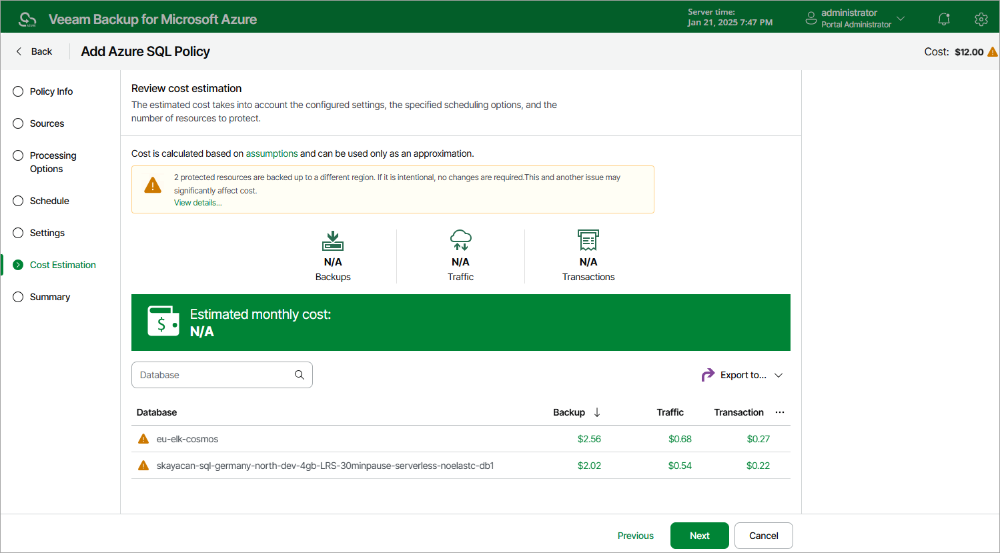

In this article

At the Cost Estimation step of the wizard, review the approximate monthly cost of Azure services that Veeam Backup for Microsoft Azure will require to protect the Azure SQL databases added to the backup policy. The total estimated cost includes the following:

* The cost of creating and maintaining backups of the Azure SQL databases.

For each Azure SQL database included in the backup policy, Veeam Backup for Microsoft Azure takes into account the size of the database and the configured scheduling settings.

* The cost of transferring Azure SQL database data between Azure regions during data protection operations (for example, if a protected Azure SQL database and the target storage account reside in different regions).

If you get a warning message regarding additional costs associated with cross-region data transfer, you can click View details to see available cost-effective options.

* The cost of making API requests to Microsoft Azure during data protection operations.

|  |
| --- |
| Note |
| To calculate the estimated cost, Veeam Backup for Microsoft Azure uses the capabilities of the [Azure Pricing Calculator](https://azure.microsoft.com/en-us/pricing/calculator/) that estimates the cost of services in USD only. This calculator is intended for informational and estimation purposes only. |

The estimated cost may occur to be significantly higher due to the backup frequency and cross-region data transfer. To reduce the cost, you can try the following workarounds:

* To avoid additional costs related to cross-region data transfer, select a repository that resides in the same region as Azure SQL databases that you plan to back up.

* To optimize the cost of storing backups, modify the scheduling settings to run the backup policy less frequently, or specify an archive repository for long-term retention of restore points.

Page updated 8/20/2025

Page content applies to build 8.0.1.202
