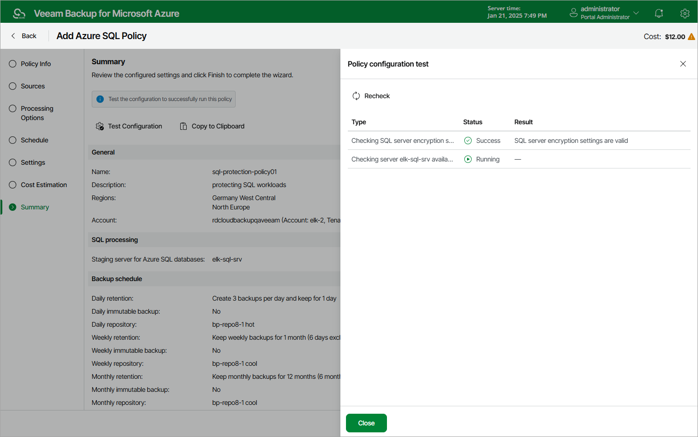

# Step 8. Finish Working with Wizard

At the Summary step of the wizard, it is recommended that you run the backup policy configuration check before you click Finish.

The configuration check will verify whether the specified accounts have all the required permissions, and networks settings are configured properly to launch worker instances. To run the configuration check, click Test Configuration. Veeam Backup for Microsoft Azure will display the Policy configuration test window where you can view the progress and results of the performed check. If the account permissions are insufficient or worker instance settings are not configured properly, the check will complete with errors.

If the configuration check discovers that network settings are not configured properly, Veeam Backup for Microsoft Azure will not be able to launch worker instances and thus perform the backup. To fix the network issues, do the following:

1. Close the Policy configuration test window, and then click Finish to close the Add Azure SQL Policy wizard.

Veeam Backup for Microsoft Azure will save the configured backup policy.

1. To prevent the backup policy from failing, disable it as described in section [Enabling and Disabling Backup Policies](backup_policy_enable_disable.md).

1. Depending on the error message received during the configuration check, do the following:

* Make sure that network settings are configured for each Azure region selected at [step 3b](sql_backup_source_settings.md#regions). For information on how to configure network settings for Azure regions, see [Managing Worker Instances](worker_configuration_network.md).
* Make sure that the virtual networks specified in the network settings for the Azure regions have access to the required Azure services. For more information on the required Azure services, see [Azure Services](azure_services.md).

1. After the network issues are fixed, you can enable the backup policy as described in section [Enabling and Disabling Backup Policies](backup_policy_enable_disable.md).

