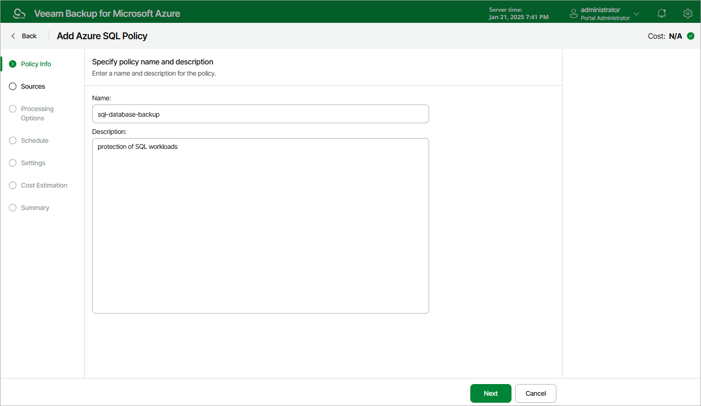

In this article

At the Policy Info step of the wizard, use the Name and Description fields to enter a name for the new backup policy and to provide a description for future reference. The maximum length of the name is 255 characters. The following characters are not supported: / \ " ' : | < > + = ; , ? ! \* % # ^ @ & $ .

Page updated 4/29/2024

Page content applies to build 8.0.1.202
