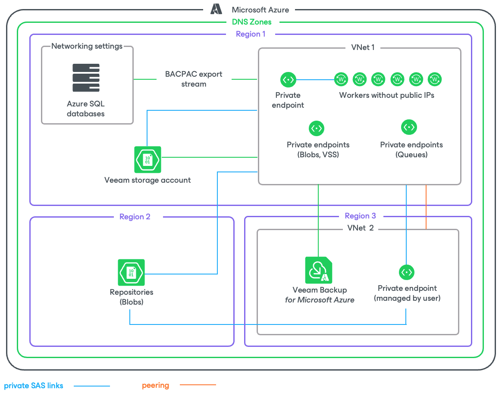

# SQL Backup in Private Environment

If the private network deployment functionality is enabled for a backup appliance, Veeam Backup for Microsoft Azure performs SQL backup in the following way:

1. [Applies only if you perform backup using a staging server] Depending on the type of the processed Azure SQL database, Veeam Backup for Microsoft Azure does the following:

* For an Azure SQL database residing on a SQL Server — creates a copy of the source database on the staging server using the Azure REST API.
* For a database residing on an Azure SQL Managed Instance — creates a copy of the source database on the staging server using [point-in-time restore (PITR)](https://docs.microsoft.com/en-us/azure/azure-sql/managed-instance/point-in-time-restore?tabs=azure-portal).

For more information on the Azure SQL family of SQL Server database engine products, see [Microsoft Docs](https://docs.microsoft.com/en-us/azure/azure-sql/?view=azuresql).

1. In the region where the processed Azure SQL database resides, Veeam Backup for Microsoft Azure checks whether there is a virtual network configured for worker instances, and whether there is a storage account assigned the Veeam tag. If there is no such network or storage account in the region, Veeam Backup for Microsoft Azure creates it.

Veeam Backup for Microsoft Azure also checks whether the following private endpoints are configured for the Veeam storage account: one endpoint required for [Azure Blob Storage](https://learn.microsoft.com/en-us/azure/storage/blobs/storage-blobs-overview) and another for [Azure Queue Storage](https://learn.microsoft.com/en-us/azure/storage/queues/storage-queues-introduction). If there are no such endpoints, Veeam Backup for Microsoft Azure creates them in the same resource group, VNet and subnet where the worker instance will be launched at step 3.

1. Veeam Backup for Microsoft Azure launches the worker instance in an Azure region where the processed Azure SQL database resides in the following way:

1. Uploads worker binary files to the Veeam storage account using a [shared access signature (SAS) URI](https://learn.microsoft.com/en-us/azure/storage/common/storage-sas-overview). Veeam Backup for Microsoft Azure validates every file by checking its MD5 key.
2. Deploys an Azure VM running Ubuntu 22.04 LTS.
3. Sends a [Run Command](https://learn.microsoft.com/en-us/azure/virtual-machines/windows/run-command) to the deployed Azure VM to download the worker binary files from the Veeam storage account using a SAS URI. These files are then used to install software components required for the worker instance to perform backup and restore operations.
4. Creates an Azure Queue in the Azure region where the backup appliance resides. Veeam Backup for Microsoft Azure then uses the Azure Queue Storage messaging service to communicate with the worker instance.

1. Exports the database schema, indexes and constraints to a BACPAC file. For more information on BACPAC files, see [Microsoft Docs](https://docs.microsoft.com/en-us/sql/relational-databases/data-tier-applications/data-tier-applications?view=sql-server-ver15#bacpac).

|  |
| --- |
| Important |
| BACPAC export of databases with external references is not supported. If a SQL database was migrated to an Azure SQL Database Server or Azure SQL Managed Instance, make sure to clear legacy references, orphaned database users and credentials set up with authentication types not supported by Azure SQL, to avoid BACPAC export errors. |

1. Reads data from the exported BACPAC file on the worker instance, compresses the data and transfers it to the target backup repository, and stores it in the native Veeam format.
2. [Applies only if you perform backup using a staging server] Removes the copy of the source database from the staging server.
3. When the backup session completes, Veeam Backup for Microsoft Azure deallocates the worker instance.
4. If you enable the [backup archiving mechanism](sql_backup_archiving.md), Veeam Backup for Microsoft Azure performs the following operations:

1. Launches a worker instance in an Azure region in which the target backup repository resides.
2. Retrieves data from the backup repository and transfers it to the target archive repository.
3. Deallocates the worker instance when the archive session completes.

