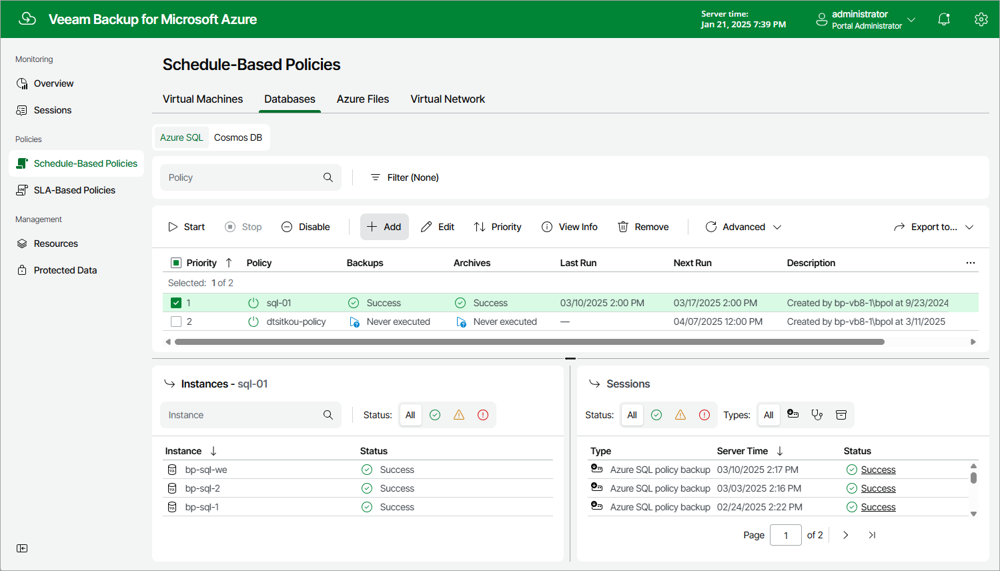

# Step 1. Launch Add Azure SQL Policy Wizard

To launch the Add Azure SQL Policy wizard, do the following:

1. Navigate to Schedule-Based Policies.
2. Switch to Databases > Azure SQL.
3. Click Add.

