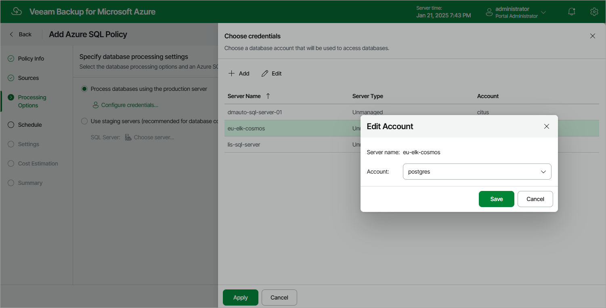
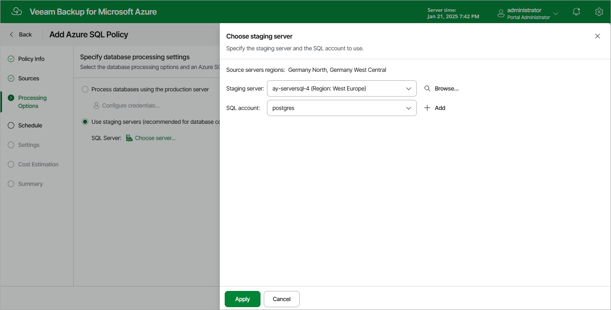

# Step 4. Configure Processing Options

At the Processing Options step of the wizard, choose whether you want to use a staging server to perform backup. To learn how Veeam Backup for Microsoft Azure uses staging servers to protect Azure SQL databases, see [SQL Backup](how_sql_backup_works.md).

Protecting Databases Without Staging Server

To back up the selected databases without a staging server, do the following:

1. Select the Process databases using the production server option.
2. Click Configure Credentials.
3. In the Choose a SQL account window:

1. For each SQL Server added to the policy, specify an Azure SQL account whose permissions Veeam Backup for Microsoft Azure will use to authenticate against the server. To do that, select the server and click Edit. Then, in the Edit Account window, select the necessary account and click Save.

For an account to be displayed in the Account list, it must be added to Veeam Backup for Microsoft Azure as described in section [Adding SMTP and Database Accounts](accounts_smtp_database_create.md). If you have not added the necessary Azure SQL account to Veeam Backup for Microsoft Azure beforehand, you can do it without closing the Add Azure SQL Policy wizard. To do that, click Add and complete the [Add Account wizard](accounts_smtp_database_create.md).

1. Click Apply.

Protecting Databases Using Staging Server

To back up the selected databases using a staging server, do the following:

1. Select the Use staging servers option.
2. Click Choose server.
3. In the Choose staging server window:

1. From the Staging server drop-down list, select a SQL Server that will be used to copy the databases. If you plan to back up a database located on an Azure SQL Managed Instance, you must specify the source SQL Server as a staging server.

For a server to be displayed in the Staging server list, it must be added to the Microsoft Azure environment as described in [Microsoft Docs](https://docs.microsoft.com/en-us/azure/azure-sql/database/single-database-manage).

|  |
| --- |
| Important |
| If you use custom Transparent Data Encryption (TDE) to protect SQL Server data, consider that the same Azure Key Vault cryptographic key must be used to encrypt the source and the staging SQL Servers to allow Veeam Backup for Microsoft Azure to perform backup using the Use staging servers option. |

1. From the SQL account drop-down list, select an Azure SQL account whose permissions Veeam Backup for Microsoft Azure will use to authenticate against the staging server.

For an account to be displayed in the Account list, it must be added to Veeam Backup for Microsoft Azure as described in section [Adding SMTP and Database Accounts](accounts_smtp_database_create.md). If you have not added the necessary Azure SQL account to Veeam Backup for Microsoft Azure beforehand, you can do it without closing the Add Azure SQL Policy wizard. To do that, click Add and complete the [Add Account wizard](accounts_smtp_database_create.md).

|  |
| --- |
| Notes |
| * To perform backup with a staging server, Veeam Backup for Microsoft Azure uses the service account specified at [step 3](sql_backup_source_settings.md#account) to send REST API requests to the SQL Servers processed by the backup policy. That is why there is no need to specify credentials for each SQL Server. * If the Azure SQL account you use to authenticate against the staging server does not have the sysadmin [server-level role](https://learn.microsoft.com/en-us/sql/relational-databases/security/authentication-access/server-level-roles?view=sql-server-ver16) assigned, you can only use the source SQL Server as a staging server — otherwise, the backup operation will fail. |

1. Click Apply.

