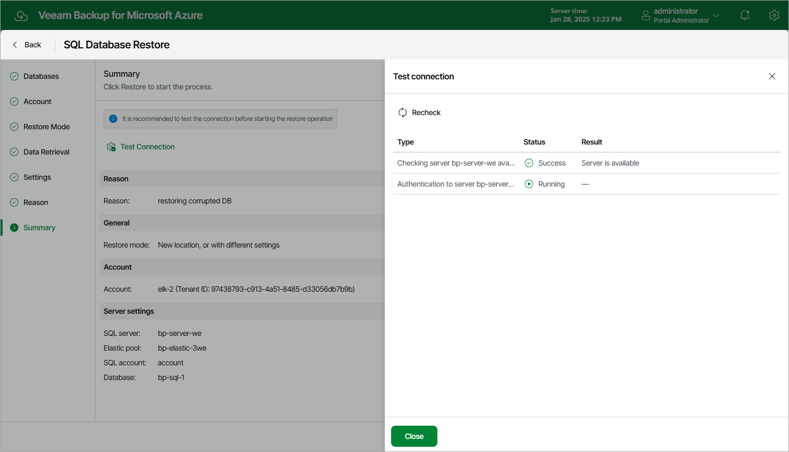

# Step 9. Finish Working with Wizard

At the Summary step of the wizard, review summary information and click Restore.

|  |
| --- |
| Tip |
| It is recommended that you check the network connection status of the target SQL Server to verify whether Veeam Backup for Microsoft Azure will be able to connect to the server to perform the restore operation. To run the connection check, click Test Connection. Veeam Backup for Microsoft Azure will display the Test connection window where you can view the progress and results of the performed check. |

Fixing Network Issues

If the backup policy check reveals that network settings are not configured properly, Veeam Backup for Microsoft Azure will not be able to launch worker instances and thus perform the operation.

To fix network issues:

1. Close the Test connection window, and then click Cancel to close the SQL Database Restore wizard.

1. Depending on the error message received after the backup policy check, do the following:

* Make sure that network settings are configured for each Azure region selected at [step 7](sql_restore_ui_settings.md). For information on how to configure network settings for Azure regions, see [Managing Worker Instances](worker_configuration_network.md).
* Make sure that virtual networks specified in network settings for Azure regions have access to the required Azure services. The required Azure services are listed in section [Azure Services](azure_services.md).

1. After network issues are fixed, you can start the SQL Database Restore wizard again.

