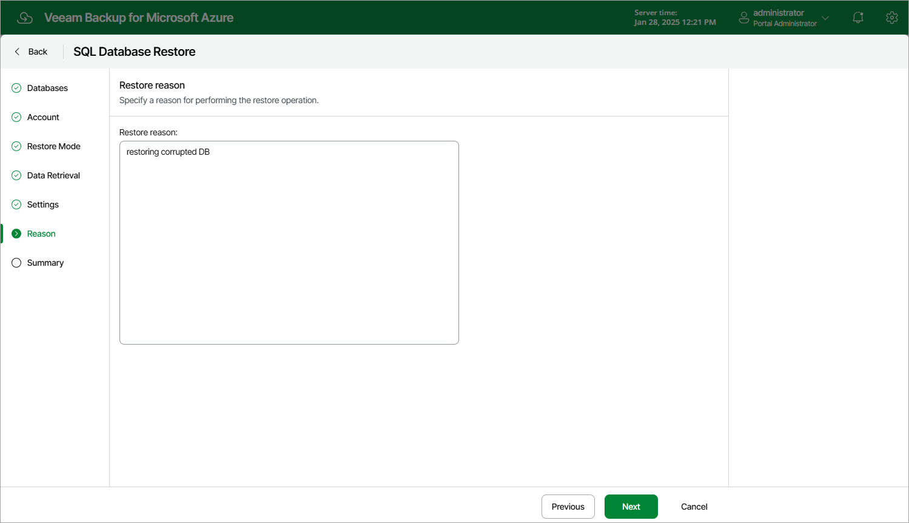

In this article

At the Reason step of the wizard, specify a reason for restoring the Azure SQL database. This information will be saved to the session history, and you will be able to reference it later.

Page updated 1/28/2025

Page content applies to build 8.0.1.202
