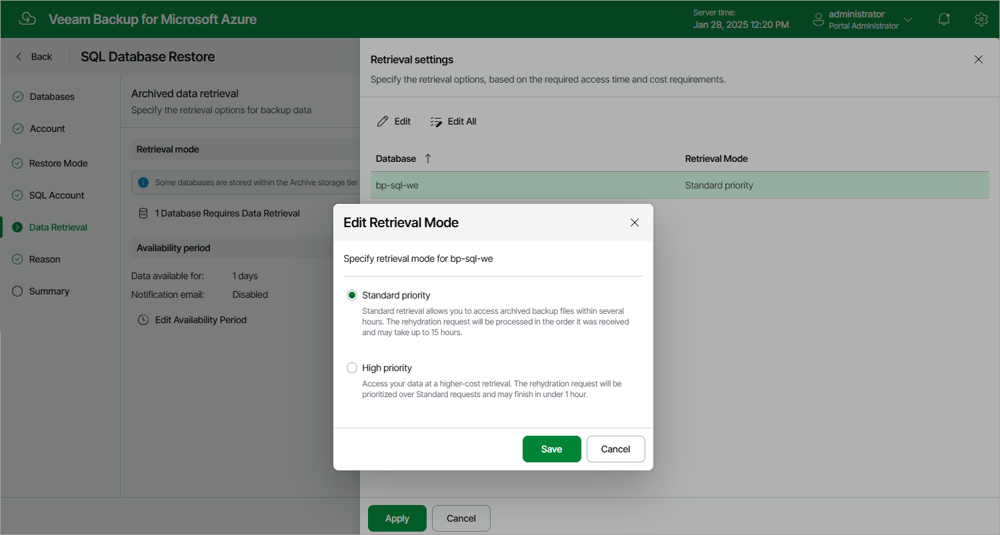
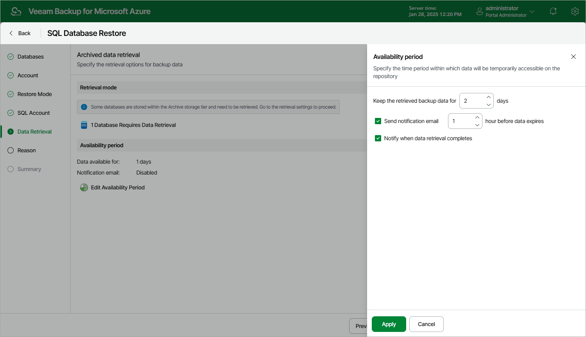

In this article

[This step applies only if you have selected a restore point stored in an archive repository at the Databases step of the wizard]

At the Data retrieval step of the wizard, choose a retrieval mode and specify a period for which you want to keep the data available.

1. Click the link in the Retrieval mode section.

1. In the Retrieval settings window, for each processed Azure SQL database, do the following:

1. Select an Azure SQL database and click Edit.

1. In the Edit Retrieval Mode window, select the retrieval mode that Veeam Backup for Microsoft Azure will use to retrieve the archived data, and click Save. For more information on data retrieval modes, see [Retrieving Data From Archive](retrieving_sql_data.md).

1. To save changes made to the data retrieval settings, click Apply.

1. Click Edit Availability Period in the Availability period section.

1. In the Availability period window, specify the number of days for which you want to keep the data available for restore operations. You can [manually extend the availability period](retrieving_sql_data.md#extend) later if required.

|  |
| --- |
| Tip |
| If you want to receive an email notification when data availability period is about to expire, select the Send notification email check box and choose when you want to be notified (that is, the number of hours remaining until data expiration). |

1. To save changes made to the availability period settings, click Apply.

Page updated 2/20/2025

Page content applies to build 8.0.1.202
