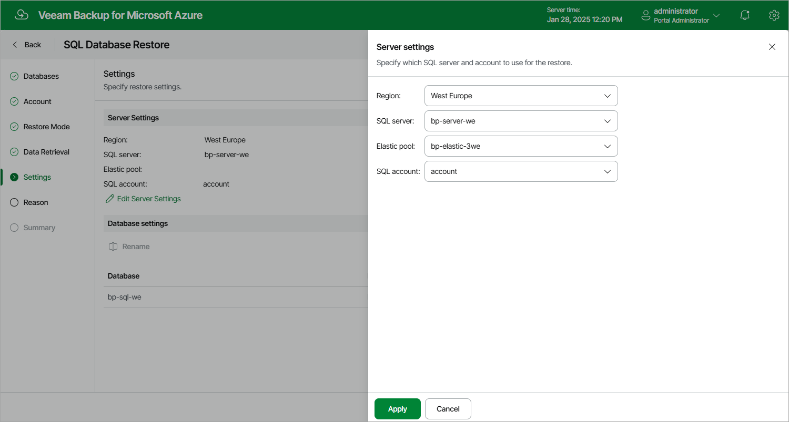

In this article

[This step applies only if you have selected the Restore to a new location, or with different settings option at the Restore Mode step of the wizard]

At the Settings step of the wizard, specify a SQL Server that will host the restored databases:

1. Click Edit Server Settings in the Server Settings section.
2. In the Server settings window, do the following:

1. From the Region drop-down list, select an Azure region where the SQL Server that will host the restored database resides.
2. From the SQL server drop-down list, select the target SQL Server.
3. From the Elastic pool drop-down list, select an elastic pool to which the restored database will be added.

For an elastic pool to be displayed in the list of available pools, it must be created in the Microsoft Azure portal as described in [Microsoft Docs](https://docs.microsoft.com/en-us/azure/azure-sql/database/elastic-pool-overview).

1. From the SQL account drop-down list, choose an Azure SQL Server account that will be used to authenticate against the target SQL Server.

For an Azure SQL Server account to be displayed in the list of available accounts, it must be added to Veeam Backup for Microsoft Azure as described in section [Adding SMTP and Database Accounts](accounts_smtp_database_create.md).

1. To save changes made to the server settings, click Apply.

1. Use the Database settings section to specify a new name for the restored database. To do that, select the database and click Rename.

Page updated 1/28/2025

Page content applies to build 8.0.1.202
