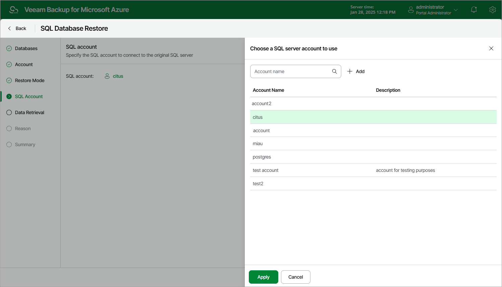

In this article

[This step applies only if you have selected the Restore to the original location option at the Restore Mode step of the wizard]

At the SQL account step of the wizard, select an Azure SQL Server account that will be used to authenticate against the SQL Server that will host the restored database.

1. Click Instance.
2. In the Choose a SQL server account to use window, select the necessary Azure SQL Server account and click Apply.

For an Azure SQL Server account to be displayed in the list of available accounts, it must be added to Veeam Backup for Microsoft Azure as described in section [Adding SMTP and Database Accounts](accounts_smtp_database_create.md).

|  |
| --- |
| Important |
| When selecting an Azure SQL Server account, consider the following:   * Portal Operators and Restore Operators can use only those Azure SQL Server accounts that have been specified for the SQL Server in settings of any backup policy created by a Portal Administrator. * Microsoft Entra ID authentication is not supported. |

Page updated 1/30/2025

Page content applies to build 8.0.1.202
