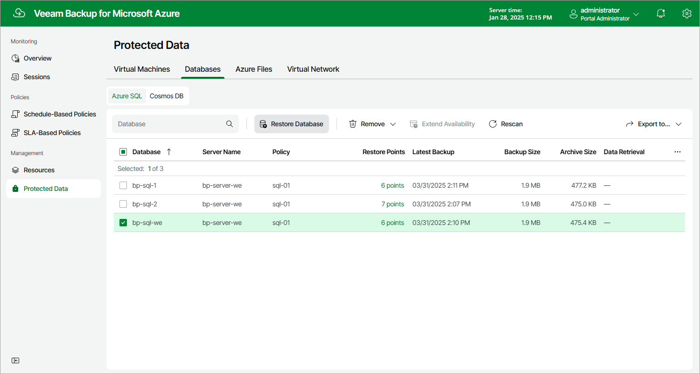

In this article

To launch the SQL Database Restore wizard, do the following:

1. Navigate to Protected Data > Databases > Azure SQL.
2. Select the Azure SQL databases that you want to restore.
3. Click Restore Database.

Alternatively, click the link in the Restore Points column. Then, in the Available Restore Points window, select the necessary restore point and click Restore Database.

Page updated 3/17/2025

Page content applies to build 8.0.1.202
