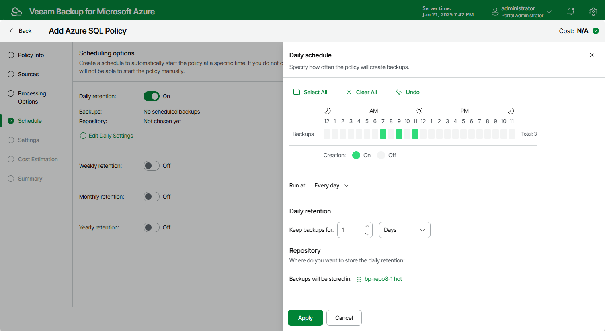

# Specifying Daily Schedule

To create a daily schedule for the backup policy, do the following at the Schedule step of the wizard:

1. Set the Daily retention toggle to On and click Edit Daily Settings.
2. In the Daily schedule window, select hours when the backup policy will create backups.

|  |
| --- |
| Note |
| Since Veeam Backup for Microsoft Azure runs retention sessions at 12:15 AM according to the time zone set on the backup appliance, it is not recommended that you schedule backup policies to execute at 12:15 AM. Otherwise, Veeam Backup for Microsoft Azure will not be able to run the retention sessions. |

1. Use the Run at drop-down list to choose whether you want the backup policy to run every day, on weekdays (Monday through Friday) or on specific days.
2. In the Daily retention section, specify the number of days (or months) for which you want to keep restore points in a backup chain.

If a restore point is older than the specified time limit, Veeam Backup for Microsoft Azure removes the restore point from the chain. For more information, see [SQL Backup Retention](sql_backup_retention.md).

1. In the Repository section, select a repository where the created backups will be stored.

For a repository to be displayed in the Repository list, it must be added to Veeam Backup for Microsoft Azure as described in section [Adding Backup Repositories](repository_add_ui.md) or [Adding Storage Vaults](repository_vdc_add_ui.md).

1. To save changes made to the backup policy settings, click Apply.

|  |
| --- |
| Tip |
| Veeam Backup for Microsoft Azure will start applying the configured retention settings as soon as the backup policy produces restore points. Even if you disable the daily schedule after the restore points are created, the retention policy will still be applied to these restore points. As a workaround, you can modify the configured retention settings. |

