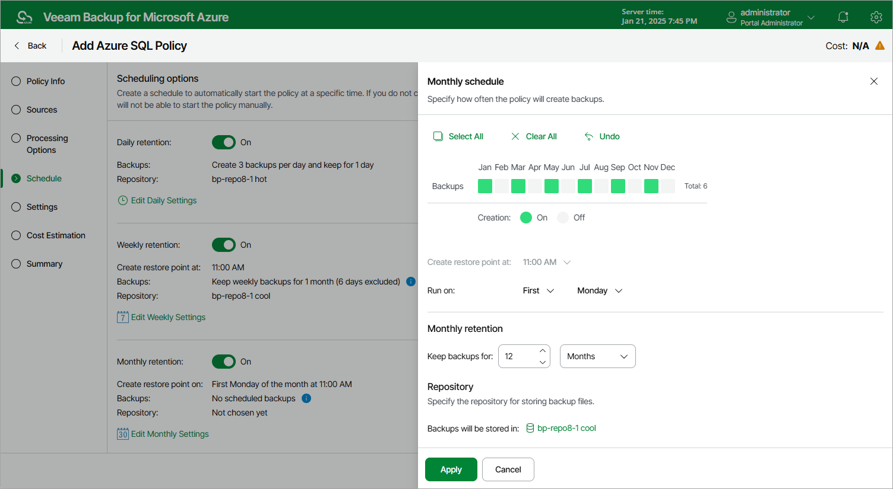

In this article

To create a monthly schedule for the backup policy, do the following at the Schedule step of the wizard:

1. Set the Monthly retention toggle to On and click Edit Monthly Settings.
2. In the Monthly schedule window, select months when the backup policy will create backups.
3. Use the Create restore points at and Run on drop-down lists to schedule a specific time and day for the backup policy to run.

|  |
| --- |
| Notes |
| * If you have selected a specific time for the backup policy to run at the Weekly schedule section of the Schedule step of the wizard, you will not be able to change the time for the monthly schedule unless you select the On Day option from the Run on drop-down list. * If you select the On Day option, [harmonized scheduling](vm_harmonized_scheduling.md) cannot be guaranteed. Plus, to support the On Day option, Veeam Backup for Microsoft Azure will require to create an additional temporary restore point if there are no other schedules planned to run on that day. However, the temporary restore point will be removed from Microsoft Azure during the Backup Retention process in approximately 24 hours, to reduce unexpected infrastructure charges. |

1. In the Monthly retention section, specify the number of days (or months) for which you want to keep restore points in a backup chain.

If a restore point is older than the specified time limit, Veeam Backup for Microsoft Azure removes the restore point from the chain. For more information, see [SQL Backup Retention](sql_backup_retention.md).

1. In the Repository section, select a repository where the created backups will be stored.

For a repository to be displayed in the Repository list, it must be added to Veeam Backup for Microsoft Azure as described in section [Adding Backup Repositories](repository_add_ui.md) or [Adding Storage Vaults](repository_vdc_add_ui.md).

1. To save changes made to the backup policy settings, click Apply.

|  |
| --- |
| Tip |
| Veeam Backup for Microsoft Azure will start applying the configured retention settings as soon as the backup policy produces restore points. Even if you disable the daily schedule after the restore points are created, the retention policy will still be applied to these restore points. As a workaround, you can modify the configured retention settings. |

Page updated 8/20/2025

Page content applies to build 8.0.1.202
