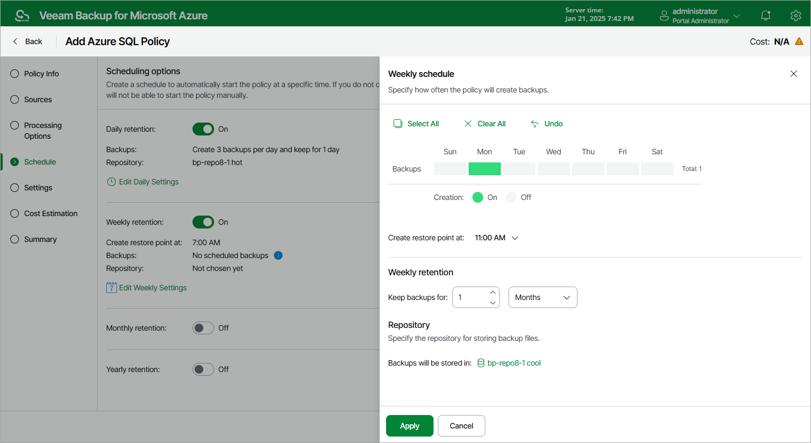

In this article

To create a weekly schedule for the backup policy, do the following at the Schedule step of the wizard:

1. Set the Weekly retention toggle to On and click Edit Weekly Settings.
2. In the Weekly schedule window, select days of the week when the backup policy will create backups.

1. Use the Create restore points at drop-down list to schedule a specific time for the backup policy to run.

1. In the Weekly retention section, specify the number of days (or months) for which you want to keep restore points in a backup chain.

If a restore point is older than the specified time limit, Veeam Backup for Microsoft Azure removes the restore point from the chain. For more information, see [SQL Backup Retention](sql_backup_retention.md).

1. In the Repository section, select a repository where the created backups will be stored.

For a repository to be displayed in the Repository list, it must be added to Veeam Backup for Microsoft Azure as described in section [Adding Backup Repositories](repository_add_ui.md) or [Adding Storage Vaults](repository_vdc_add_ui.md).

1. To save changes made to the backup policy settings, click Apply.

|  |
| --- |
| Tip |
| Veeam Backup for Microsoft Azure will start applying the configured retention settings as soon as the backup policy produces restore points. Even if you disable the daily schedule after the restore points are created, the retention policy will still be applied to these restore points. As a workaround, you can modify the configured retention settings. |

Page updated 8/20/2025

Page content applies to build 8.0.1.202
