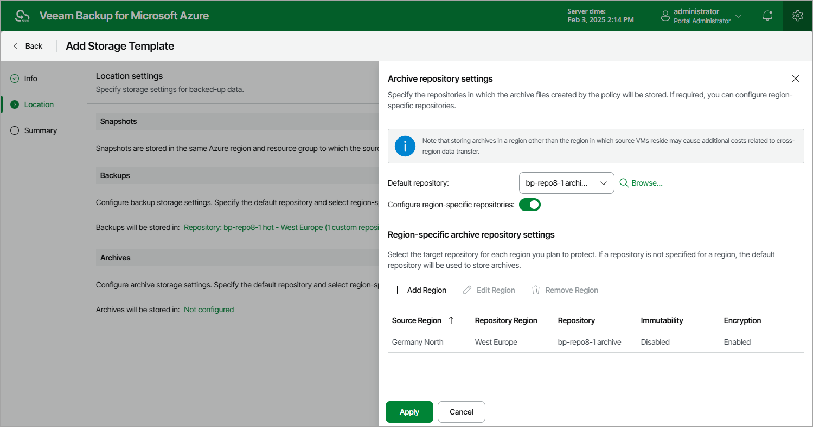

In this article

At the Location step of the wizard, you can specify target locations where Veeam Backup for Microsoft Azure will keep restore points produced by all SLA-based backup policies that will have this storage template assigned.

By default, Veeam Backup for Microsoft Azure 8.1 stores cloud-native snapshots produced by SLA-based backup policies in the same Azure regions where the source VMs reside — snapshots created for Azure VMs with managed disks are saved to the same resource groups to which the source VMs belong, while snapshots created for Azure VMs with unmanaged disks are saved to the same Azure storage account where these disks reside. Consider that the Add Storage Template wizard does not allow you to use to choose another target location for cloud-native snapshots — you can only choose target locations for image-level backups and archived backups. As a workaround, you can use the Add SLA-Based Policy wizard to specify another resource group as a target location for cloud-native snapshots; to do that, follow the instructions provided in section [Creating SLA-Based VM Backup Policies](vm_sla_tags_snapshot_location.md#location).

|  |
| --- |
| Note |
| Unmanaged disks will be retired in Microsoft Azure on March 31, 2026. That is why it is recommended that you migrate your Azure VMs to managed disks. For more information, see [Microsoft Docs](https://learn.microsoft.com/el-gr/azure/virtual-machines/unmanaged-disks-deprecation). |

To configure location settings for the storage template, do the following:

1. Specify a target location (repository) where image-level backups will be stored. To do that, click the link in the Backups section. Then, select the necessary repository from the Default repository drop-down list in the Backup repository settings window.

By default, Veeam Backup for Microsoft Azure will use the selected repository for all protected regions. To instruct Veeam Backup for Microsoft Azure to use separate repositories for each region:

1. Set the Configure region-specific repositories toggle to On.
2. In the Region-specific backup repository settings section, click Add Region.
3. In the Configure Region Settings window, choose a region and a repository that you want to use for this region.

For a repository to be displayed in the list of available repositories, it must be added to Veeam Backup for Microsoft Azure as described in section [Managing Repositories](repositories.md). If you have not added the repository to Veeam Backup for Microsoft Azure beforehand, you can do it without closing the Select Repository and Configure Region Settings windows. To do that, click Add and complete the Add Repository wizard.

1. Specify a target location (archive repository) where archived backups will be stored. To do that, click the link in the Archives section. Then, select the necessary repository from the Default repository drop-down list in the Archive repository settings window.

By default, Veeam Backup for Microsoft Azure will use the selected repository for all protected regions. To instruct Veeam Backup for Microsoft Azure to use separate repositories for each region:

1. Set the Configure region-specific repositories toggle to On.

1. In the Region-specific archive repository settings section, click Add Region.
2. In the Configure Region Settings window, choose a region and a repository that you want to use for this region.

For an archive repository to be displayed in the list of available repositories, it must be added to Veeam Backup for Microsoft Azure as described in section [Managing Repositories](repositories.md). If you have not added the repository to Veeam Backup for Microsoft Azure beforehand, you can do it without closing the Select Repository and Configure Region Settings windows. To do that, click Add and complete the Add Repository wizard.

|  |
| --- |
| Important |
| To be able to choose a target location for archived backups, you must specify a target location for image-level backups first. |

Page updated 11/26/2025

Page content applies to build 8.0.1.202
