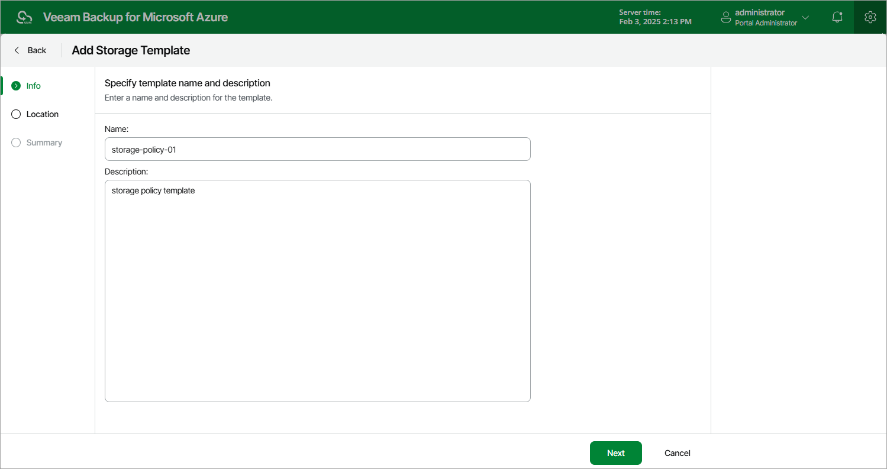

# Step 2. Specify Template Name

At the Info step of the wizard, enter a name for the new storage template and provide a description for future reference. The maximum length of the name is 255 characters. The following characters are not supported: / \ " ' : | < > + = ; , ? ! \* % # ^ @ & $ .

