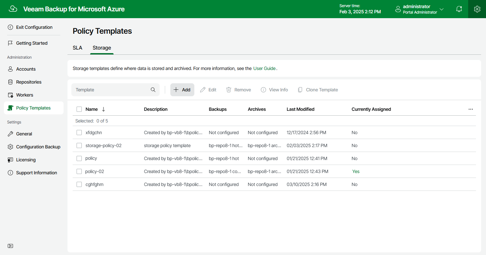

In this article

To launch the Add Storage Template wizard, do the following:

1. Switch to the Configuration page.
2. Navigate to Policy Templates > Storage.
3. Click Add.

Page updated 3/31/2025

Page content applies to build 8.0.1.202
