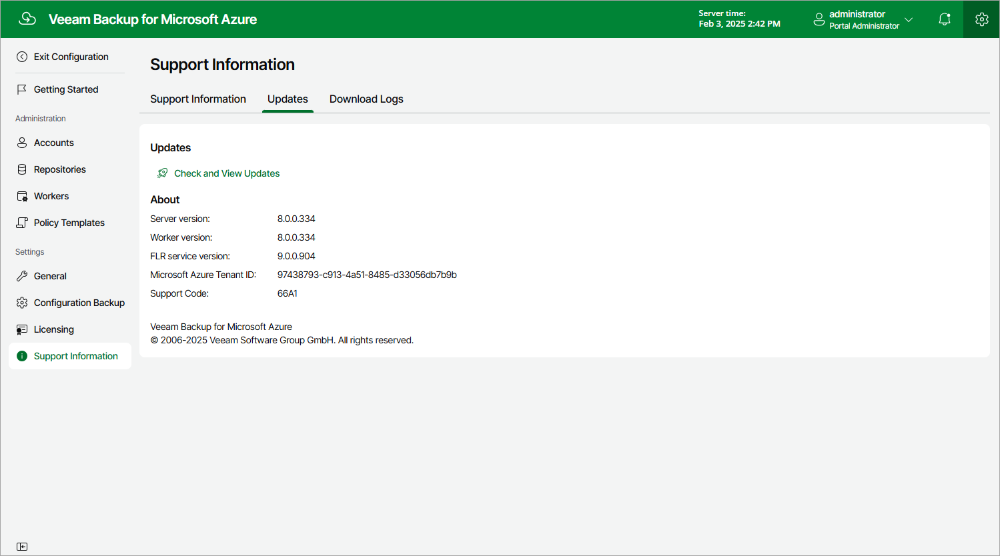
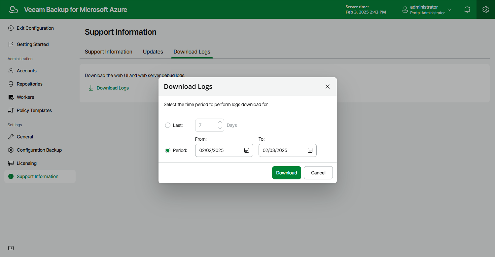
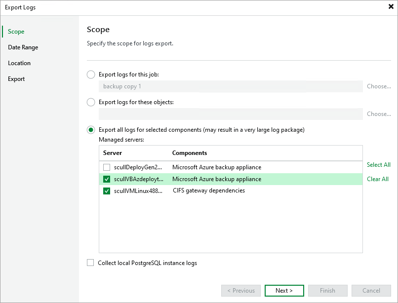

# Getting Technical Support

If you have any questions or issues with Veeam Backup for Microsoft Azure, you can search for a resolution on [Veeam R&D Forums](https://forums.veeam.com/) or submit a support case in the [Veeam Customer Support Portal](https://www.veeam.com/support.html).

When you submit a support case, it is recommended that you provide the Veeam Customer Support Team with the following information:

* [Version information for the product and its components](#product_details)
* The error message or an accurate description of the problem you are facing
* [Log files](#downloading_logs)

Viewing Product Details Using Veeam Backup for Microsoft Azure Web UI

To view the product details, do the following:

1. Switch to the Configuration page.
2. Navigate to Support Information > Updates.

The About section of the Updates page displays the following information:

* Server version — the currently installed version of Veeam Backup for Microsoft Azure.
* Worker version — the version of worker instances launched by Veeam Backup for Microsoft Azure.
* FLR service version — the version of the File-level recovery service currently running on the backup appliance.
* Microsoft Azure Tenant ID — the unique identification number of the Microsoft Entra tenant to which the backup appliance belongs.
* Support Code — the unique identification number of the Veeam support contract.

|  |
| --- |
| Tip |
| You can click the link in the Updates section to check for, download and install new product versions and available software package updates. For more information, see [Updating Veeam Backup for Microsoft Azure](updating_vb.md). |

Downloading Product Logs Using Veeam Backup for Microsoft Azure Web UI

To download the product logs, do the following:

1. Switch to the Download Logs tab.
2. Click Download Logs.
3. In the Download Logs window, specify a time interval for which the logs will be collected:

* Select the Last option if you want to collect data for a specific number of days in the past.
* Select the Period option if you want to collect data for a specific period of time in the past.

After you click Download, the logs will be saved locally in the default download folder as a single .ZIP archive.

Downloading Product Logs Using Veeam Backup & Replication Console

To export the product logs, do the following:

1. In the Veeam Backup & Replication console, open the main menu and navigate to Help > Support Information.
2. In the Export Logs wizard, do the following:

1. At the Scope step, select the Export all logs for selected components option. Then, in the Managed servers list, select the backup server, backup appliances and other components for which you want to export logs.
2. Complete the wizard as described in the Veeam Backup & Replication User Guide, section [Export Logs](https://helpcenter.veeam.com/docs/vbr/userguide/export_logs_date.html?ver=13).

