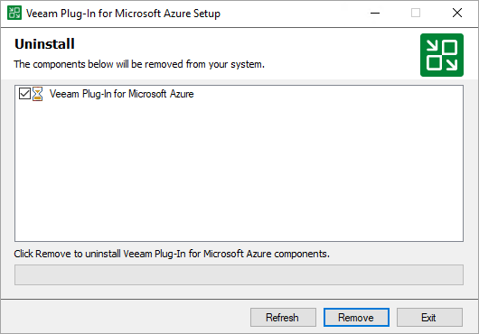

# Uninstalling Plug-In

Before you uninstall Veeam Plug-in for Microsoft Azure, it is recommended that you [remove all connected backup appliances](removing_appliance_console.md) from the backup infrastructure. If you keep the appliances in the backup infrastructure, the following will happen:

* You will be able to see information on snapshots of Azure VMs and file shares in the Veeam Backup & Replication console. However, you will not be able to perform any operations with these snapshots.

* You will be able to see information on backups of Azure SQL databases. However, you will not be able to perform any operations with these backups.
* You will be able to see information on image-level backups of Azure VMs and perform data recovery operations using these backups. However, restore of entire VMs to Microsoft Azure will start working as described in the Veeam Backup & Replication User Guide, section [How Restore to Microsoft Azure Works](https://helpcenter.veeam.com/docs/vbr/userguide/restore_azure_hiw.html?ver=13).

* You will be able to see information on backup policies. However, you will only be able to remove these policies from the Veeam Backup & Replication console.

To uninstall Veeam Plug-in for Microsoft Azure, do the following:

1. Log in to the backup server using an account with the local Administrator permissions.
2. Open the Start menu, navigate to Control Panel > Programs > Programs and Features.
3. In the program list, click Veeam Plug-in for Microsoft Azure and click Uninstall.
4. In the opened window, click Remove.

|  |
| --- |
| Note |
| After you uninstall Veeam Plug-in for Microsoft Azure, you will be no longer able to add backup appliances and new external repositories to the backup infrastructure. |

