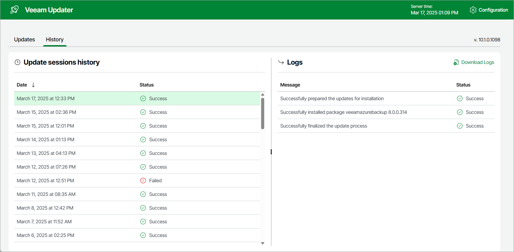

In this article

To see the results of the update installation performed on the backup appliance, do the following:

1. Switch to the Configuration page.
2. Navigate to Support Information.
3. Switch to the Updates tab.
4. Click Check and View Updates.
5. On the Veeam Updater page, switch to the History tab.

For each date when an update was installed, the Veeam Updater page will display the name of the update and its status (whether the installation process completed successfully, completed with warnings or failed to complete).

To download logs for the installed updates, select the necessary date in the Date section, and click Download Logs. Veeam Backup for Microsoft Azure will save the logs as a single file to the default download directory on the local machine.

Page updated 5/30/2025

Page content applies to build 8.0.1.202
