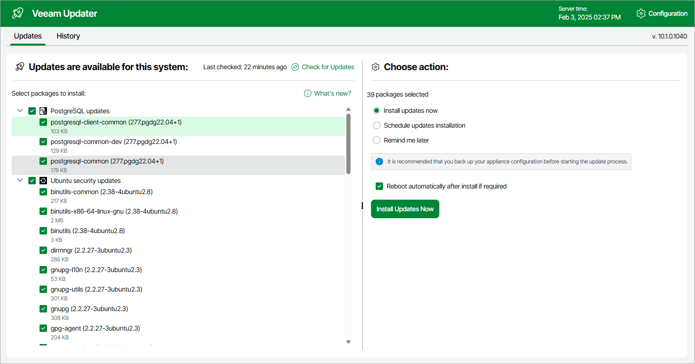
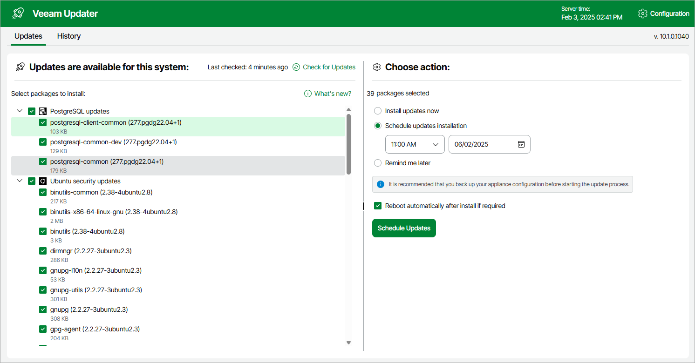
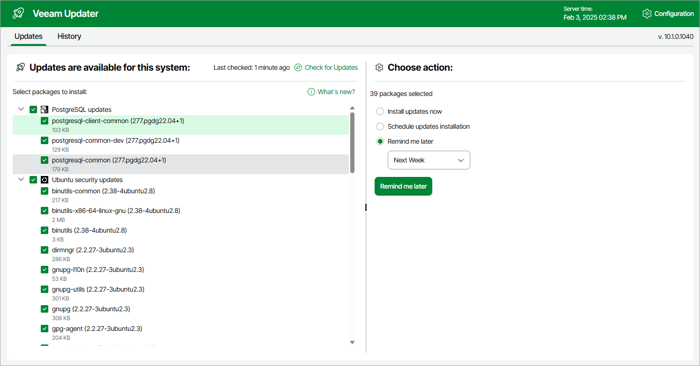

In this article

To download and install new product versions and available software package updates, you can do either of the following:

* [Install updates immediately](#install_update)
* [Schedule update installation](#schedule_update)

You can also [set a reminder to send update notifications](#reminder).

|  |
| --- |
| Important |
| * Updating standalone backup appliances manually is not supported. You can update these appliances using the Veeam Updater service only. * Upgrading backup appliances managed by Veeam Backup & Replication servers backup appliances using the Veeam Updater service is not supported. You can upgrade these appliances using the Veeam Backup & Replication as described in section [Updating Appliances Using Console](updating_console.md). |

Installing Updates

|  |
| --- |
| Important |
| Before you install a product update, make sure that all backup policies are both disabled and stopped, and no restore tasks are currently executing. Otherwise, the update process will interrupt the running activities, which may result in data loss. |

To download and install available product and software package updates:

1. Open the Veeam Updater page:

1. Switch to the Configuration page.
2. Navigate to Support Information.
3. Switch to the Updates tab.
4. Click Check and View Updates.

1. On the Veeam Updater page, do the following:

1. In the Updates are available for this system section, select check boxes next to the necessary updates.
2. In the Choose action section, select the Install updates now option, select the Reboot automatically after install if required check box to allow Veeam Backup for Microsoft Azure to reboot the backup appliance if needed, and then click Install Updates Now.

|  |
| --- |
| Note |
| The updater may require you to read and accept the Veeam license agreement and the 3rd party components license agreement. If you reject the agreements, you will not be able to continue installation. |

Veeam Backup for Microsoft Azure will download and install the updates; the results of the installation process will be displayed on the [History tab](update_history.md). Keep in mind that it may take several minutes for the installation process to complete.

|  |
| --- |
| Note |
| When installing product updates, Veeam Backup for Microsoft Azure restarts all services running on the backup appliance, including the Web UI service. That is why Veeam Backup for Microsoft Azure may log you out when the update process completes. |

Scheduling Update Installation

You can instruct Veeam Backup for Microsoft Azure to automatically download and install available product versions and software package updates on a specific date at a specific time:

1. On the Veeam Updater page, in the Updates are available for this system section, select check boxes next to the necessary updates.
2. In the Choose action section, do the following:

1. Select the Schedule updates installation option and configure the necessary schedule.

|  |
| --- |
| Important |
| When selecting a date and time when updates must be installed, make sure no backup policies are scheduled to run at the selected time. Otherwise, the update process will interrupt the running activities, which may result in data loss. |

1. Select the Reboot automatically after install if required check box to allow Veeam Backup for Microsoft Azure to reboot the backup appliance if needed.
2. Click Schedule Updates.

Veeam Backup for Microsoft Azure will automatically download and install the updates on the selected date at the selected time; the results of the installation process will be displayed on the [History tab](update_history.md).

Setting Update Reminder

If you have not decided when to install available product versions and software package updates, you can set an update reminder — instruct Veeam Backup for Microsoft Azure to send an update notification later.

To do that, on the Veeam Updater page, in the Choose action section, do the following:

1. Select the Remind me later option and choose when you want to receive the reminder.

If you select the Next Week option, Veeam Backup for Microsoft Azure will send the reminder on the following Monday.

1. Click Remind me later.

Page updated 11/25/2025

Page content applies to build 8.0.1.202
