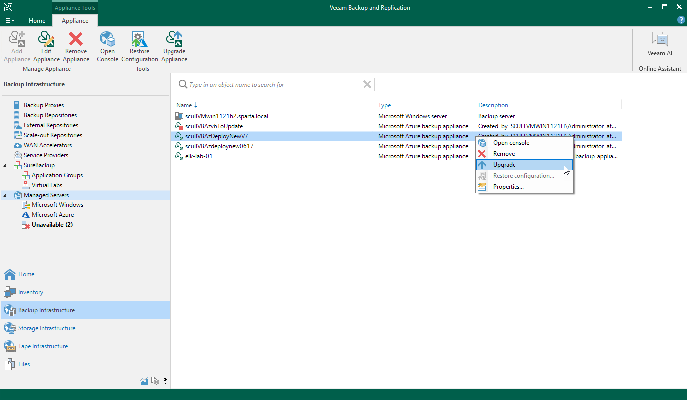

# Updating Appliances Using Console

Starting from Veeam Backup for Microsoft Azure version 5a, you can upgrade backup appliances from the Veeam Backup & Replication console only. However, if you already have a backup appliance running Veeam Backup for Microsoft Azure version 8.1, you can simply restore to it the configuration of a backup appliance you want to upgrade as described in section [Restoring Configuration Data Using Console](configuration_restore_console.md). Direct upgrade to Veeam Backup for Microsoft Azure version 8.1 is supported from Veeam Backup for Microsoft Azure version 6.0 or 7.0; to upgrade from an earlier version, you must first perform [upgrade to Veeam Backup for Microsoft Azure version 6.0 or 7.0](https://helpcenter.veeam.com/archive/vbazure/70/guide/upgrading_appliances_console.html).

|  |
| --- |
| Important |
| * Before you upgrade a backup appliance, check whether the Veeam Backup for Microsoft Azure version is compatible with the current version of Veeam Plug-in for Microsoft Azure. For more information, see [System Requirements](system_requirements.md#compatibility). * If your backup appliance used the Azure Service Bus messaging service in versions prior to version 8.1, you must switch to the Azure Queue Storage service in the appliance Web UI immediately after you upgrade to version 8.1. Otherwise, Veeam Backup for Microsoft Azure will no longer be able to perform backup and restore operations. For more information, see [Configuring Deployment Mode](deployment_mode.md#messaging). |

Veeam Plug-in for Microsoft Azure allows you to download and install new available Veeam Backup for Microsoft Azure versions and software package updates:

1. In the Veeam Backup & Replication console, open the Backup Infrastructure view.
2. Navigate to Managed Servers.
3. Select the necessary backup appliance and click Upgrade Appliance on the ribbon.

Alternatively, right-click the appliance and select Upgrade.

|  |
| --- |
| Note |
| As soon as you click Upgrade Appliance, Veeam Backup & Replication will verify connection to the specified backup appliance. If the appliance is assigned a dynamic IP address, you will receive a warning regarding the retirement of these IP addresses. To learn how to eliminate this warning, see [Eliminating Warnings](eliminating_warnings.md). |

