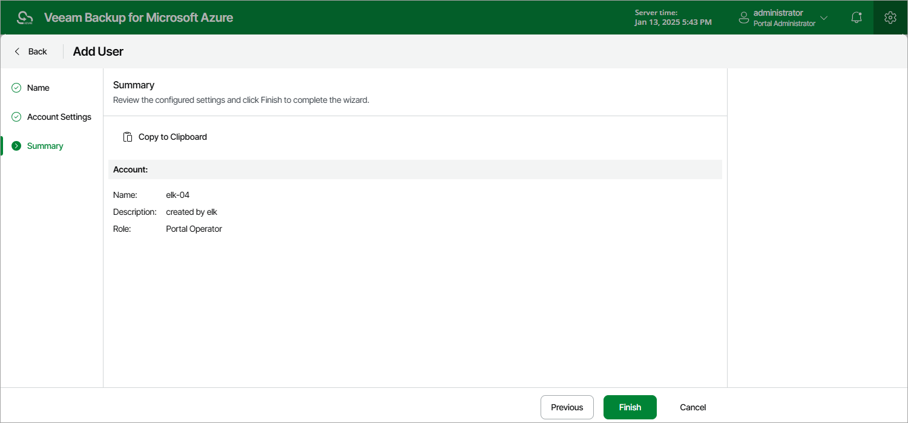

# Adding User Accounts

To manage access to Veeam Backup for Microsoft Azure, you can create local user accounts or add user accounts of your identity provider. To be able to retrieve user identities from the identity provider, you must first [configure single sign-on settings](configuring_sso.md).

To add a Veeam Backup for Microsoft Azure user account, do the following:

1. Switch to the Configuration page.
2. Navigate to Accounts > Portal Users.
3. Click Add.

1. Complete the Add User wizard.

1. At the Type step of the wizard, choose whether you want to create a new Veeam Backup for Microsoft Azure user or to retrieve a user identity from your identity provider.

1. At the Name step of the wizard, specify a name and description for the user account.

The maximum length of the account name is 32 characters. An account name can contain only lowercase and uppercase Latin letters, numeric characters, underscores and dashes. A description can contain only lowercase and uppercase Latin letters, numeric characters, dots, commas and spaces.

|  |
| --- |
| Important |
| If you have selected the Identity Provider account option at step 4.a, the name specified for a user account must match the value of an attribute that the identity provider will send to Veeam Backup for Microsoft Azure to authenticate the user. For more information, see [Configuring SSO Settings](configuring_sso.md#IdpAttribute). |

1. At the Account Settings step of the wizard, select a role for the user account. For more information on user roles, see [Managing User Accounts](managing_permissions.md).

If you have selected the Veeam Backup for Microsoft Azure account option at step 4.a, specify a password for the new Veeam Backup for Microsoft Azure user account.

1. At the Summary step of the wizard, review summary information and click Finish.

