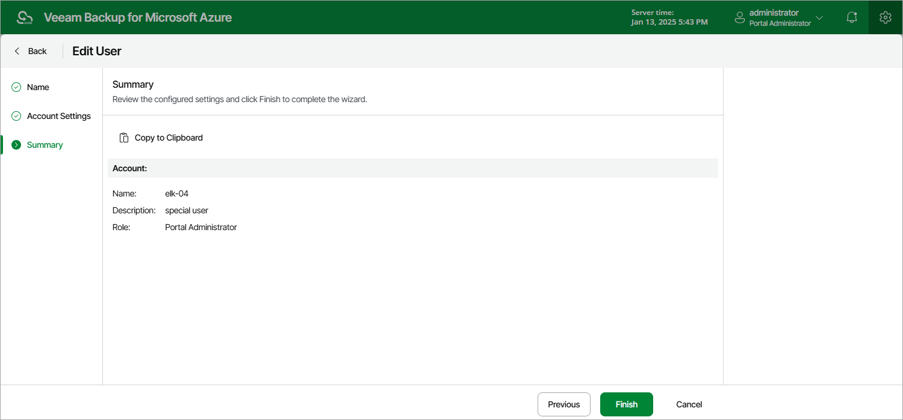

# Editing User Accounts

For each user account, you can modify settings configured while adding the account:

1. Switch to the Configuration page.
2. Navigate to Accounts > Portal Users.
3. Select the account and click Edit.
4. Complete the Edit User wizard:

1. At the Name step, provide a new description for the account.
2. At the Account Settings step, choose a new role for the account.
3. At the Summary step, review summary information and click Finish to confirm the changes.

|  |
| --- |
| Important |
| If your backup appliance is managed by a Veeam Backup & Replication server, do not change the role of a user whose credentials Veeam Backup & Replication uses to connect to the backup appliance. Otherwise, the connection will not be established. |

