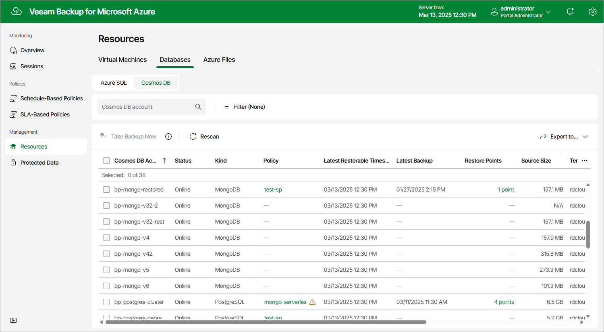

# Viewing Available Resources

After you create a backup policy to protect a specific type of Azure resources (Azure VMs, Azure SQL databases, Cosmos DB accounts or Azure file shares), Veeam Backup for Microsoft Azure rescans Azure regions specified in the policy settings and populates the resource list on the Resources page with all resources of that type residing in these regions. If a region is no longer specified in any backup policy, Veeam Backup for Microsoft Azure removes resources residing in the region from the list of available resources.

The Resources page displays Azure resources that can be protected by Veeam Backup for Microsoft Azure. Each resource is represented with a set of properties, such as:

* Virtual Machines or Databases (Azure SQL or Cosmos DB) or Azure Files — the name of the resource.
* Policy — the name of the backup policy that protects the resource (if any).
* Region — the region in which the resource resides.
* Restore Points — the number of restore points created for the resource (if any).
* Latest Backup — the date and time of the most recent backup policy (if any).

On the Resources page, you can also perform the following actions:

* Manually create backups of Azure SQL databases, Cosmos DB for PostgreSQL accounts and Cosmos DB for MongoDB accounts. For more information, see [Performing SQL Backup](creating_sql_backups_manually.md) and [Performing Cosmos DB Backup](creating_cosmos_db_backups_manually.md).
* Manually create cloud-native snapshots of Azure VMs and Azure file shares. For more information, see sections [Performing VM Backup](creating_vm_snapshots_manually.md) and [Performing Azure Files Backup](creating_fs_snapshots_manually.md).

