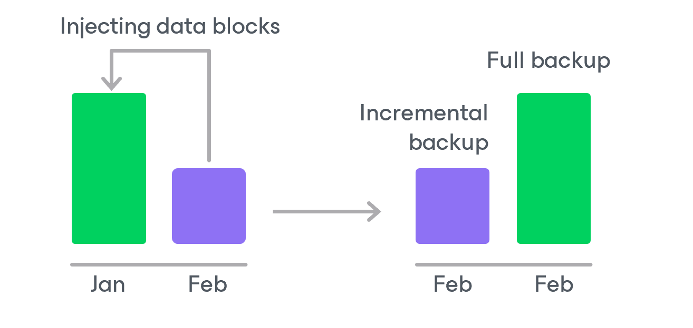
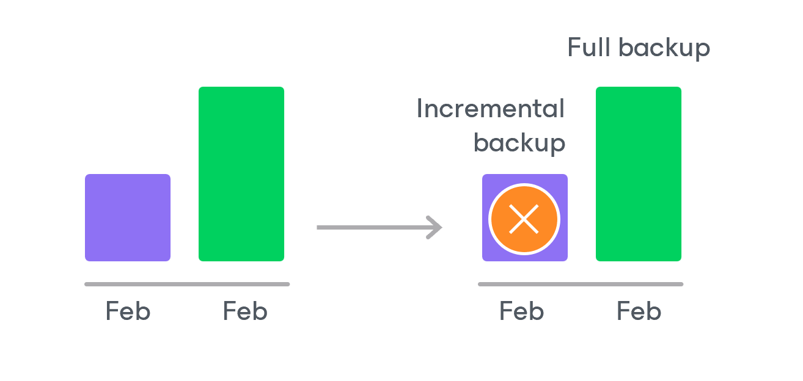
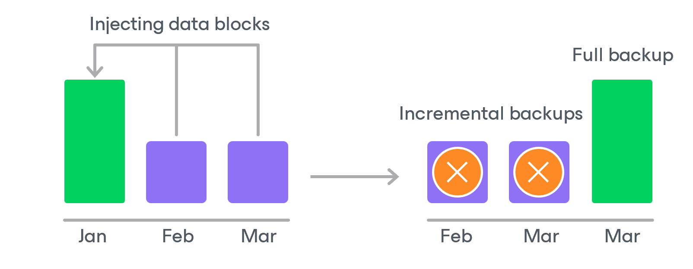

# Retention Policy for Archived Backups

For archived backups, Veeam Backup for Microsoft Azure retains restore points for the number of days defined in backup scheduling settings as described in section [Creating VM Backup Policies](vm_backup_policy_schedule.md).

To track and remove outdated restore points from an archive backup chain, Veeam Backup for Microsoft Azure performs the following actions once a day:

1. Veeam Backup for Microsoft Azure checks the configuration database to detect archive repositories that contain outdated restore points.
2. If an outdated restore point exists in a repository, Veeam Backup for Microsoft Azure transforms the archive backup chain in the following way:

1. Veeam Backup for Microsoft Azure rebuilds the full archive backup to include data of the incremental archive backup that follows the full archive backup. To do that, Veeam Backup for Microsoft Azure injects into the full archive backup data blocks from the earliest incremental archive backup in the chain. This way, the full archive backup ‘moves’ forward in the archive backup chain.

1. Veeam Backup for Microsoft Azure removes the earliest incremental archive backup from the chain as redundant — this data has already been injected into the full archive backup.

1. Veeam Backup for Microsoft Azure repeats step 2 for all other outdated restore points found in the archive backup chain until all the restore points are removed. As data from multiple restore points is injected into the rebuilt full archive backup, Veeam Backup for Microsoft Azure ensures that the archive backup chain is not broken and that you will be able to recover your data when needed.

