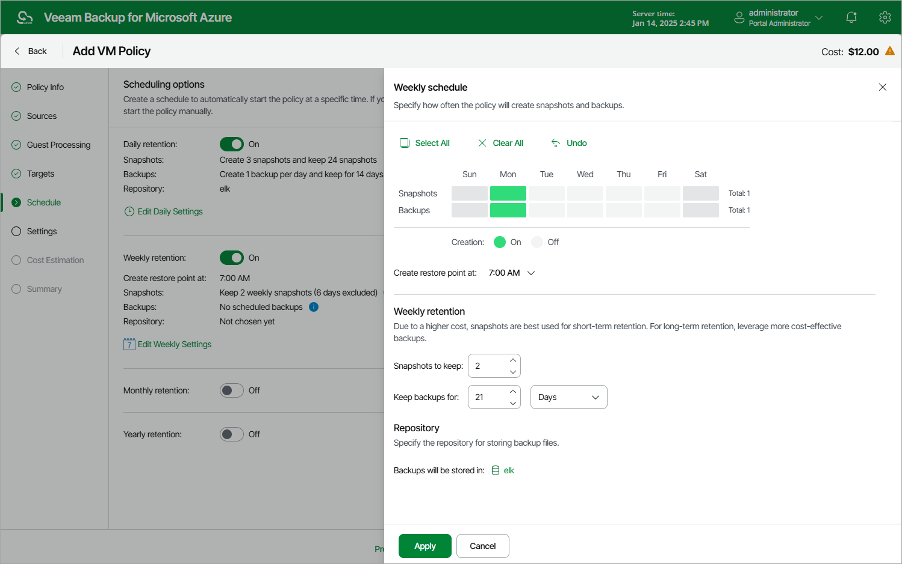
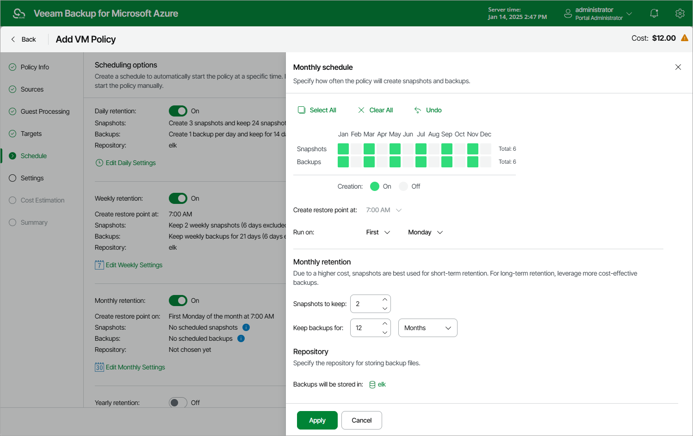
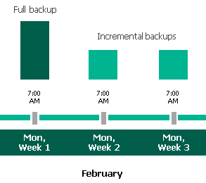
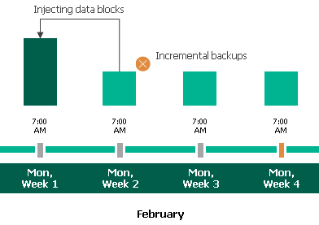
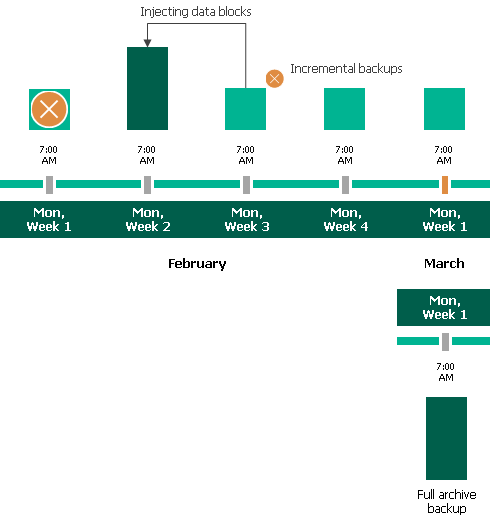
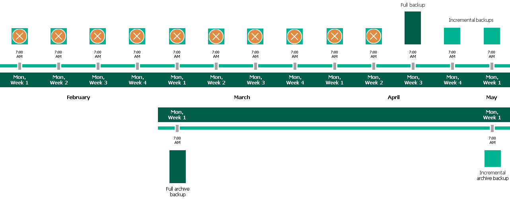
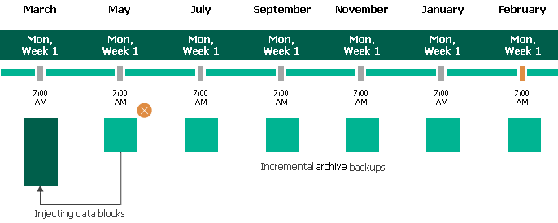

In this article

When you combine multiple types of schedules, you can enable the archiving mechanism to instruct Veeam Backup for Microsoft Azure to store backed-up data in the low-cost, long-term Archive access tier. The mechanism is the most useful in the following cases:

* Your data retention policy requires that you keep rarely accessed data in an archive.
* You want to reduce data-at-rest costs and to save space in the high-cost, short-term Hot and Cool access tiers.

|  |
| --- |
| Note |
| It is usually more expensive and takes more time to restore data from archived backups than from regular backups as it requires Veeam Backup for Microsoft Azure to retrieve the data from the Archive access tier. For more information, see [Retrieving Data From Archive](retrieving_vm_data.md). |

With backup archiving, Veeam Backup for Microsoft Azure can retain backups created according to a daily, weekly or monthly schedule for longer periods of time:

* To enable monthly archiving, you must configure a daily or a weekly schedule (or both).
* To enable yearly archiving, you must configure a daily, a weekly or a monthly schedule (or all three).

For Veeam Backup for Microsoft Azure to use the archiving mechanism, you must specify at least 2 different schedules: one schedule will control the regular creation of backups, while another schedule will control the process of copying backups to an archive repository. Backup chains created according to these two schedules will be completely different — for more information, see [Backup Chain](backup_chain_vm.md) and [Archive Backup Chain](archive_chain.md).

Consider the following example. You want a backup policy to create image-level backups of your critical workloads once a week, to keep the backed-up data in a repository for 3 weeks, and also to keep backups created once in 2 months in an archive repository for a year. In this case, you create 2 schedules when configuring the backup policy settings — weekly and monthly:

1. In the weekly scheduling settings, you do the following:

1. Specify hours and days when backups will be created (for example, 7:00 AM, Monday), and specify the number of days for which Veeam Backup for Microsoft Azure will retain backups (for example, 21 days).
2. Select a repository of the Hot or Cool access tier that will store regular backups.

Veeam Backup for Microsoft Azure will propagate these settings to the archive schedule (which is the monthly schedule in our example).

1. In the monthly scheduling settings, you do the following:

1. Specify when Veeam Backup for Microsoft Azure will create archive backups, and choose for how long you want to retain the created backups (for example, January, March, May, July, September, November, 12 months and First Monday).
2. Enable the archiving mechanism by selecting a repository of the Archive access tier that will store archive backups.

Note that when you enable backup archiving, you become no longer able to create a schedule of the same frequency for regular backups. By design, these two functionalities are mutually exclusive.

|  |
| --- |
| Important |
| If you enable backup archiving, consider the following:   * It is recommended that you set the Snapshots to keep value to 0, to reduce unexpected snapshot charges. * It is recommended that you set the Keep backups for value to at least 6 months (or 180 days), since the minimum storage duration of the Archive access tier is 180 days. * If you select the On Day option, [harmonized scheduling](vm_harmonized_scheduling.md) cannot be guaranteed. Plus, to support the On Day option, Veeam Backup for Microsoft Azure will require to create an additional temporary restore point if there are no other schedules planned to run on that day. However, the temporary restore point will be removed during the Backup Retention process from Microsoft Azure Storage in approximately 24 hours, to reduce unexpected infrastructure charges. |

According to the specified scheduling settings, Veeam Backup for Microsoft Azure will create image-level backups in the following way:

1. On the first Monday of February, a backup session will start at 7:00 AM to create the first restore point in the regular backup chain. Veeam Backup for Microsoft Azure will store this restore point as a full backup in the repository.
2. On the second and third Mondays of February, Veeam Backup for Microsoft Azure will create restore points at 7:00 AM and add them to the regular backup chain as incremental backups in the repository.

1. On the fourth Monday of February, Veeam Backup for Microsoft Azure will create a new restore point at 7:00 AM. By the moment the backup session completes, the earliest restore point in the regular backup chain will get older than the specified retention limit. That is why Veeam Backup for Microsoft Azure will rebuild the full backup and remove from the chain the restore point created on the first Monday.

For more information on how Veeam Backup for Microsoft Azure transforms regular backup chains, see [VM Backup Retention](vm_backup_retention.md).

1. On the first Monday of March, a backup session will start at 7:00 AM to create another restore point in the regular backup chain. At the same time, the earliest restore point in the regular backup chain will get older than the specified retention limit again. That is why Veeam Backup for Microsoft Azure will rebuild the full backup again and remove from the chain the restore point created on the second Monday.

After the backup session completes, an archive session will create a restore point with all data from the regular backup chain. Veeam Backup for Microsoft Azure will copy this restore point as a full archive backup to the archive repository.

1. Up to May, Veeam Backup for Microsoft Azure will continue adding new restore points to the regular backup chain and deleting outdated backups from the repository, according to the specified weekly scheduling settings.

On the first Monday of May, an archive session will create a restore point with only that data that has changed since the previous archive session in March. Veeam Backup for Microsoft Azure will copy this restore point as an incremental archive backup to the archive repository.

1. Up to the first Monday of February of the next year, Veeam Backup for Microsoft Azure will continue adding new restore points to the regular backup chain and deleting outdated backups from the repository, according to the specified weekly scheduling settings. Veeam Backup for Microsoft Azure will also continue adding new restore points to the archive backup chain, according to the specified monthly settings.

By the moment the archive session completes, the earliest restore point in the archive backup chain will get older than the specified retention limit. That is why Veeam Backup for Microsoft Azure will rebuild the full archive backup and remove from the chain the restore point created on the first Monday of March of the previous year.

For more information on how Veeam Backup for Microsoft Azure transforms archive backup chains, see [Retention Policy for Archived Backups](vm_archive_backup_retention.md).

Consider that data encryption must be either enabled or disabled for both backup and archive backup repositories selected within the same backup archiving configuration. For example, you cannot select an encrypted standard backup repository and an unencrypted archive backup repository to store backups. However, you can select repositories with different data encryption configurations in one backup policy. That is, you can select an encrypted standard backup repository, an encrypted archive backup repository, an unencrypted standard backup repository and an unencrypted archive backup repository. In this case, backups created in the encrypted standard backup repository will be copied to the encrypted archive backup repository, and backups created in the unencrypted standard backup repository will be copied to the unencrypted archive backup repository. Also, the selected repositories can have different encryption options (password and Azure Key Vault cryptographic key encryption).

Page updated 8/20/2025

Page content applies to build 8.0.1.202
