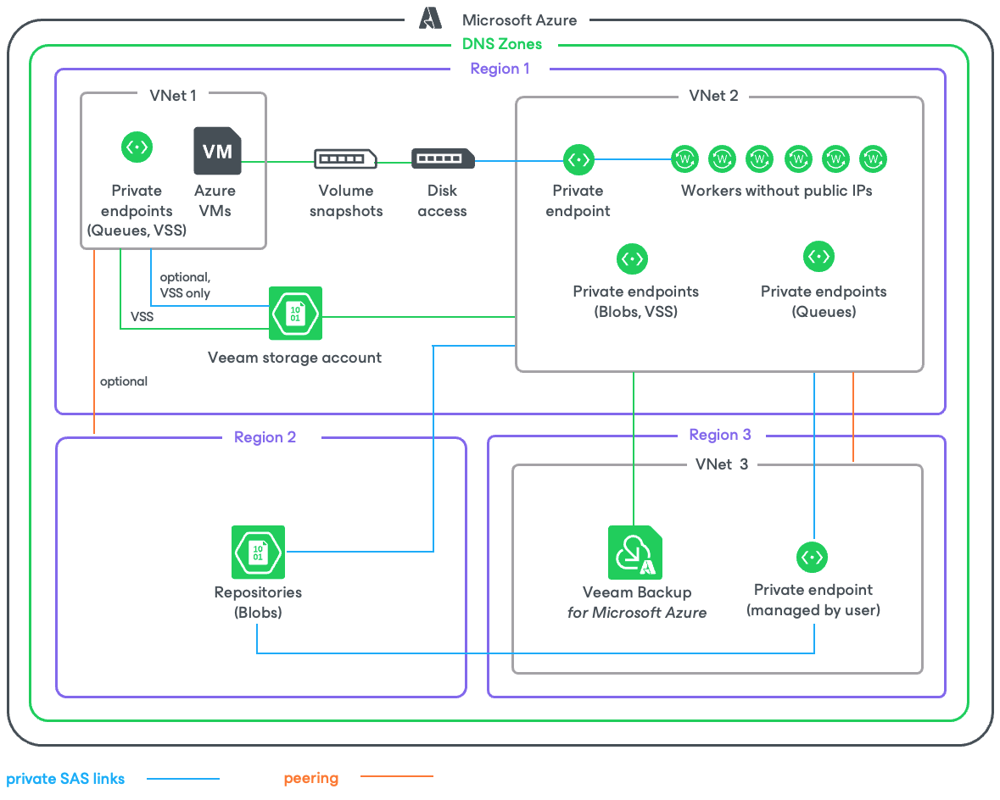

In this article

If the private network deployment functionality is enabled for a backup appliance, Veeam Backup for Microsoft Azure performs VM backup in the following way:

1. Veeam Backup for Microsoft Azure creates snapshots of virtual disks that are attached to the processed Azure VM.

Disk snapshots are assigned Azure tags upon creation. Values of Azure tags contain encrypted metadata that helps Veeam Backup for Microsoft Azure identify the related disk snapshots and treat them as a single unit — a cloud-native snapshot. For this reason, you must not delete any Azure tags whose names start with the word veeam.

1. In the region where the processed Azure VM resides, Veeam Backup for Microsoft Azure checks whether there is a virtual network configured for worker instances, and whether there is a storage account assigned the Veeam backup appliance ID tag with the ID of Azure VM running the backup appliance in the tag value. If there is no such network or storage account in the region, Veeam Backup for Microsoft Azure creates it.

Veeam Backup for Microsoft Azure also checks whether the following private endpoints are configured for the Veeam storage account: one endpoint required for [Azure Blob Storage](https://learn.microsoft.com/en-us/azure/storage/blobs/storage-blobs-overview) and another for [Azure Queue Storage](https://learn.microsoft.com/en-us/azure/storage/queues/storage-queues-introduction). If there are no such endpoints, Veeam Backup for Microsoft Azure creates them in the same resource group, VNet and subnet where the worker instance will be launched at step 3.

1. Veeam Backup for Microsoft Azure launches the worker instance in the Azure region where the processed Azure VM resides in the following way:

1. Uploads worker binary files to the Veeam storage account using a [shared access signature (SAS) URI](https://learn.microsoft.com/en-us/azure/storage/common/storage-sas-overview). Veeam Backup for Microsoft Azure validates every file by checking its MD5 key.
2. Deploys an Azure VM running Ubuntu 22.04 LTS.
3. Sends a [Run Command](https://learn.microsoft.com/en-us/azure/virtual-machines/windows/run-command) to the deployed Azure VM to download the worker binary files from the Veeam storage account using a SAS URI. These files are then used to install software components required for the worker instance to perform backup and restore operations.
4. Creates an Azure Queue in the Azure region where the backup appliance resides. Veeam Backup for Microsoft Azure then uses the Azure Queue Storage messaging service to communicate with the worker instance.

1. [Applies only if the processed Azure VM and the backup appliance are associated with the same Azure subscription] In the region where the worker instance is launched, Veeam Backup for Microsoft Azure checks whether disk access resources sufficient for the backup operation are created for the Azure subscription associated with the backup appliance. If the disk access resources are insufficient, Veeam Backup for Microsoft Azure creates them and associates these resources with the cloud-native snapshot created at step 1.
2. Veeam Backup for Microsoft Azure reads data from the cloud-native snapshot using SAS URIs, compresses the data and transfers it to the target backup repository, and stores it in the native Veeam format. Then, Veeam Backup for Microsoft Azure removes the SAS URIs.

To reduce the amount of data read from snapshots, Veeam Backup for Microsoft Azure uses the changed block tracking (CBT) mechanism: during incremental backup sessions, Veeam Backup for Microsoft Azure compares the new cloud-native snapshot with the previous one and reads only those data blocks that have changed since the previous backup session. For more information, see [Changed Block Tracking](changed_block_tracking.md).

1. When the backup session completes, Veeam Backup for Microsoft Azure deallocates the worker instance.
2. If you enable the [backup archiving mechanism](sql_backup_archiving.md), Veeam Backup for Microsoft Azure performs the following operations:

1. Launches a worker instance in an Azure region in which the target backup repository resides.
2. Retrieves data from the backup repository and transfers it to the target archive repository.
3. When the archive session completes, deallocates the worker instance.

Page updated 5/13/2025

Page content applies to build 8.0.1.202
