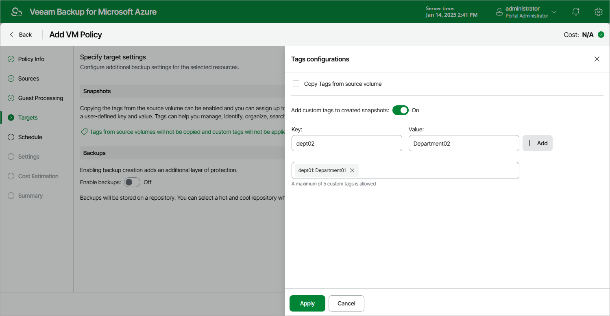

In this article

By default, backup policies create only cloud-native snapshots of processed Azure VMs. At the Targets step of the wizard, you can enable the following additional data protection scenarios:

* In the Snapshot section, you can assign tags to cloud-native snapshots of the selected Azure VMs:

1. Click Tags from source volumes will not be copied and custom tags will not be applied.

1. In the Tags configurations window, choose whether you want to assign tags to the created snapshots.

* To assign already existing tags from the source virtual disks, select the Copy Tags from source volume check box.
* To assign your own custom tags, set the Add custom tags to created snapshots toggle to On, and specify the tags explicitly. Click Apply. Note that you cannot add more than 5 custom tags.

* In the Backups section, set the Enable backups toggle to On to instruct Veeam Backup for Microsoft Azure to create image-level backups.

Page updated 11/10/2023

Page content applies to build 8.0.1.202
