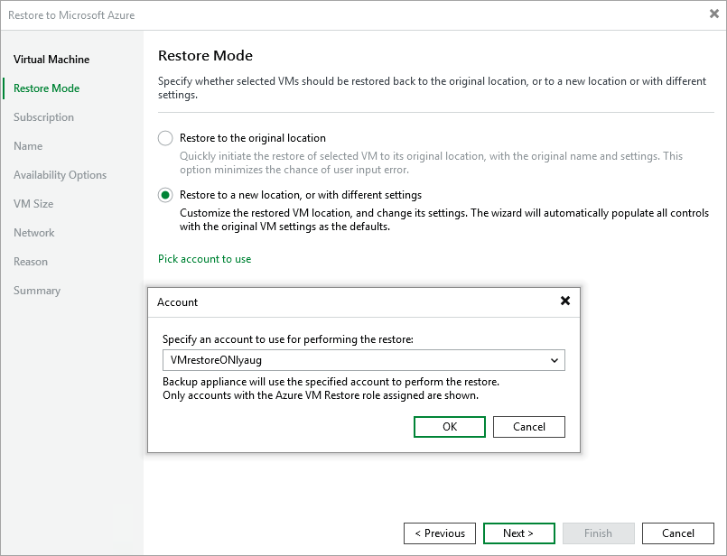

In this article

At the Restore Mode step of the wizard, do the following:

1. Choose whether you want to restore the selected Azure VM to the original or to a new location.

1. Click Pick account to use to select a service account whose permissions will be used to perform the restore operation. For more information on the required permissions, see [Service Account Permissions](service_account_permissions.md).

For a service account to be displayed in the list of available accounts, it must be added to Veeam Backup for Microsoft Azure and assigned the Azure VM Restore operational role as described in section [Adding Service Accounts](service_account_select_roles.md).

|  |
| --- |
| Note |
| To perform restore operations, Veeam Backup & Replication uses permissions of service accounts that belong to the tenants that contained original VMs. If none of the service accounts added to Veeam Backup for Microsoft Azure belong to these tenants, the Restore to the original location option will not be available. |

Page updated 8/26/2025

Page content applies to build 8.0.1.202
