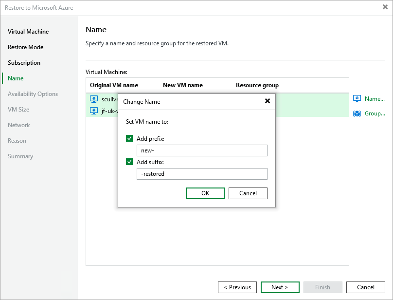

In this article

[This step applies only if you have selected the Restore to a new location, or with different settings option at the Restore Mode step of the wizard]

At the Name step of the wizard, specify a new name and a resource group for the restored Azure VM. To do that, select the necessary VM from the list and perform the following steps:

1. Click Name and specify a new name for the restored VM in the Change Name window. It is recommended that you choose the new name carefully — due to Microsoft Azure limitations, you will not be able to rename the VM after the restore operation completes.

Note that the name must meet the [Microsoft Azure resource name rules](https://docs.microsoft.com/en-us/azure/azure-resource-manager/management/resource-name-rules#microsoftcompute).

|  |
| --- |
| Tip |
| You can specify a single prefix or suffix and add it to the names of multiple Azure VMs. To do that, select the necessary instances and click Name. In the Change Name window, select the Add prefix or Add suffix check box, and provide the text that you want to add. Then, click OK. |

1. Click Group and select a resource group to which the restored VM will belong in the Resource group window.

For a resource group to be displayed in the list of available groups, it must be created in Microsoft Azure as described in [Microsoft Docs](https://docs.microsoft.com/en-us/azure/azure-resource-manager/management/manage-resource-groups-portal).

Page updated 8/26/2025

Page content applies to build 8.0.1.202
