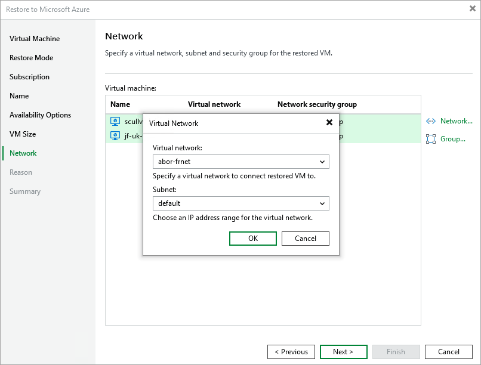

In this article

[This step applies only if you have selected the Restore to a new location, or with different settings option at the Restore Mode step of the wizard]

At the Network step of the wizard, you can configure specific network settings for the restored Azure VM. To do that, select the VM and perform the following steps:

1. Click Network and, in the Virtual Network window, choose to which virtual network and subnet the restored VM will be connected.

For a virtual network to be displayed in list of available networks, it must be created for the region specified at [step 4](vm_restore_console_subscription.md) in Microsoft Azure, as described in [Microsoft Docs](https://learn.microsoft.com/en-us/azure/virtual-network/manage-virtual-network#create-a-virtual-network).

For a subnet to be displayed in the list of available networks, it must be created in the specified virtual network as described in [Microsoft Docs](https://learn.microsoft.com/en-us/azure/virtual-network/virtual-network-manage-subnet).

1. Click Group and, in the Network Security Group window, specify a security group (virtual firewall) that will be associated with the restored VM.

For a network security group to be displayed in the list of available groups, it must be created in Microsoft Azure and associated with the specified subnet, as described in [Microsoft Docs](https://docs.microsoft.com/en-us/azure/virtual-network/tutorial-filter-network-traffic#create-a-network-security-group).

Page updated 8/26/2025

Page content applies to build 8.0.1.202
