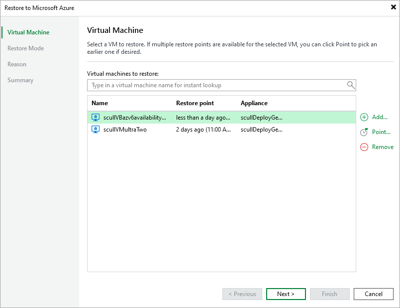

# Step 2. Select VM and Restore Point

At the Virtual Machine step of the wizard, choose a restore point that will be used to restore the selected Azure VM. By default, Veeam Backup & Replication uses the most recent valid restore point. However, you can restore the VM data to an earlier state.

To select a restore point, do the following:

1. In the Virtual machines to restore list, select the Azure VM and click Point.
2. In the Restore Points window, expand the backup policy that protects the VM, select the necessary restore point and click OK.

To help you choose a restore point, Veeam Backup & Replication provides the following information on each available restore point:

* Job — the name of the backup policy that created the restore point and the date when the restore point was created.
* Type — the type of the restore point.
* Location — the region (for snapshots) or repository (for backups) where the restore point is stored.

|  |
| --- |
| Tip |
| You can use the wizard to restore multiple instances at a time. To do that, click Add, select more Azure VMs to restore and choose a restore point for each of them. |

Note that if you want to restore an Azure VM from a backup that is stored in a repository of the Archive access tier, you must first retrieve the archived data. That is why Veeam Backup & Replication will open the Retrieve Backup wizard if the selected restore point is stored in an archive repository. To learn how to complete the wizard and retrieve the archived data, see [Retrieving Data from Archive](retriving_archived_data.md).

