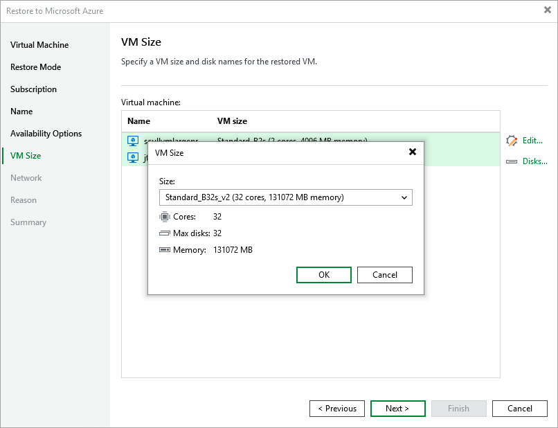

In this article

[This step applies only if you have selected the Restore to a new location, or with different settings option at the Restore Mode step of the wizard]

At the VM size step of the wizard, you can change the VM size for the restored Azure VM and specify a new name for each restored virtual disk. To do that, select the VM and perform the following steps:

1. Click Edit, and select the necessary VM size in the VM Size window. For more information on Azure VM sizes, see [Microsoft Docs](https://learn.microsoft.com/en-us/azure/virtual-machines/sizes-general).

|  |
| --- |
| Important |
| If the size of the original Azure VM differs from the size of the restored VM, Microsoft Azure may apply additional charges for maintaining the restored Azure VM. |

1. Click Disks, and select a virtual disk you want to rename in the VM Disks window. Then, click Name.

In the Change Name window, specify a new name for the selected virtual disk.

|  |
| --- |
| Tip |
| You can specify a single prefix or suffix and add it to the names of multiple restored virtual disks. To do that, select the necessary disks and click Name. In the Change Name window, select the Add prefix or Add suffix check box, and provide the text that you want to add. Then, click OK. |

Page updated 8/26/2025

Page content applies to build 8.0.1.202
