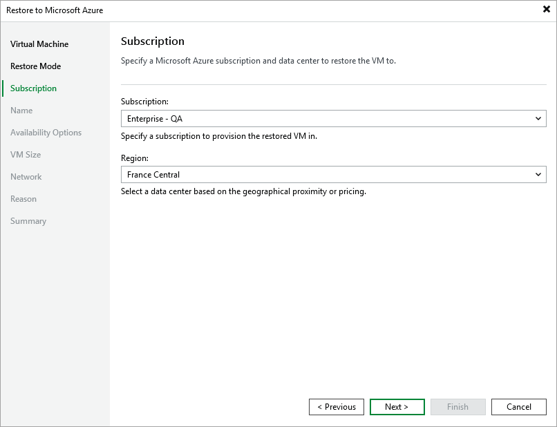

In this article

[This step applies only if you have selected the Restore to a new location, or with different settings option at the Restore Mode step of the wizard]

At the Subscription step of the wizard, do the following:

1. From the Subscription drop-down list, select an Azure subscription that will be used to manage the restored Azure VM.

For a subscription to be displayed in the list of available subscriptions, it must be [created in Microsoft Azure](https://learn.microsoft.com/en-us/azure/cost-management-billing/manage/create-subscription) and [associated with the Microsoft Entra tenant](https://docs.microsoft.com/en-us/azure/active-directory/fundamentals/active-directory-how-subscriptions-associated-directory) to which the service account specified at [step 3](vm_restore_console_mode.md) belongs.

1. From the Region drop-down list, select the target region where the restored Azure VM will operate.

If the selected region differs from the original location of Azure VM, Veeam Backup & Replication will raise a warning notifying that the locations do not match. Click Yes to acknowledge the warning. Otherwise, you will not be able to proceed with the wizard.

|  |
| --- |
| Note |
| Data transfer to a new location may require additional costs and may take more time to complete. |

Page updated 8/26/2025

Page content applies to build 8.0.1.202
