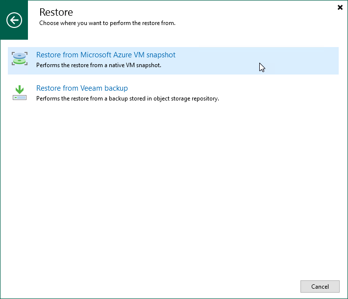

# Step 1. Launch Restore to Microsoft Azure Wizard

To launch the Restore to Microsoft Azure wizard, do the following:

1. In the Veeam Backup & Replication console, open the Home view.
2. Navigate to Backups > Snapshots if you want to restore from a cloud-native snapshot, or to Backups > External Repository if you want to restore from an image-level backup.
3. In the working area, expand the backup policy that protects an Azure VM that you want to restore, select the necessary VM and click Microsoft Azure Iaas on the ribbon.

Alternatively, you can right-click the instance and select Restore to Microsoft Azure Iaas.

|  |
| --- |
| Tip |
| You can also launch the Restore to Microsoft Azure wizard from the Home tab. To do that, click Restore and select Microsoft Azure. Then, in the Restore window, select Microsoft Azure Iaas > Entire machine restore > Restore to public cloud > Restore to Microsoft Azure and, depending on whether you want to restore from a backup or a snapshot, click either Restore from Microsoft Azure VM snapshot or Restore from Veeam backup. |

