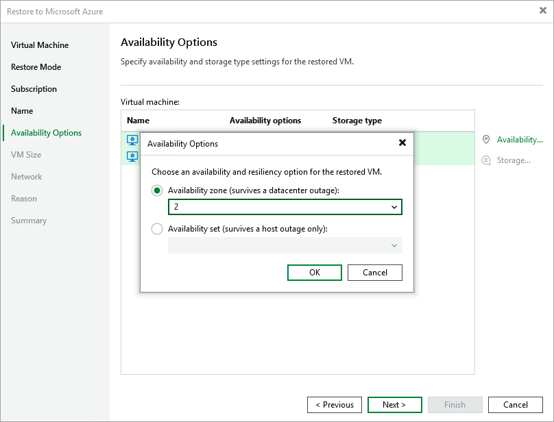

In this article

[This step applies only if you have selected the Restore to a new location, or with different settings option at the Restore Mode step of the wizard]

At the Availability Options step of the wizard, specify configuration settings for the restored Azure VM. To do that, select the VM and perform the following steps:

1. Click Availability and, in the Availability Options window, choose whether you want to require any infrastructure redundancy to achieve high availability:

* Select the Availability zone option to restore the VM to a specific availability zone within the selected Azure region, and choose the necessary zone from the drop-down list.
* Select the Availability set option to include the VM in an availability set, and choose the necessary set from the drop-down list. For the availability set to be displayed in the list of available sets, it must be created in Microsoft Azure. For more information on availability sets, see [Microsoft Docs](https://learn.microsoft.com/en-us/azure/virtual-machines/availability-set-overview).

|  |
| --- |
| Important |
| You cannot include Azure VMs with managed disks into unmanaged availability sets, and Azure VMs with unmanaged disks into managed availability sets. |

1. [Applies only to Azure VMs with unmanaged disks] Click Storage and, in the Storage type window, choose whether you want to migrate Azure unmanaged disks to Azure managed disks for the restored VM. For more information on Azure managed disks, see [Microsoft Docs](https://learn.microsoft.com/en-us/azure/virtual-machines/managed-disks-overview).

If you choose to restore the VM with unmanaged disks, select credentials of a Microsoft Azure storage account in which the restored virtual disks will reside. For credentials to be displayed in the list of available credentials, they must be created in Microsoft Azure as described in [Microsoft Docs](https://docs.microsoft.com/en-us/azure/storage/common/storage-account-create?tabs=azure-portal#create-a-storage-account).

Page updated 8/26/2025

Page content applies to build 8.0.1.202
