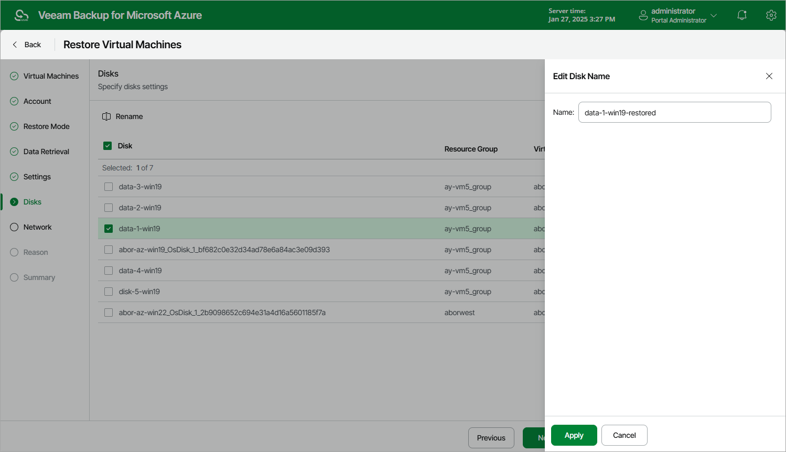

In this article

[This step applies only if you have selected the Restore to a new location, or different settings option at the Restore Mode step of the wizard]

At the Disks step of the wizard, you can specify a new name for each restored virtual disk:

1. Select a virtual disk that you want to rename, and click Rename.
2. In the Edit Disk Name window, specify a name that you want to use for the selected virtual disk, and click Apply.

Page updated 2/2/2024

Page content applies to build 8.0.1.202
