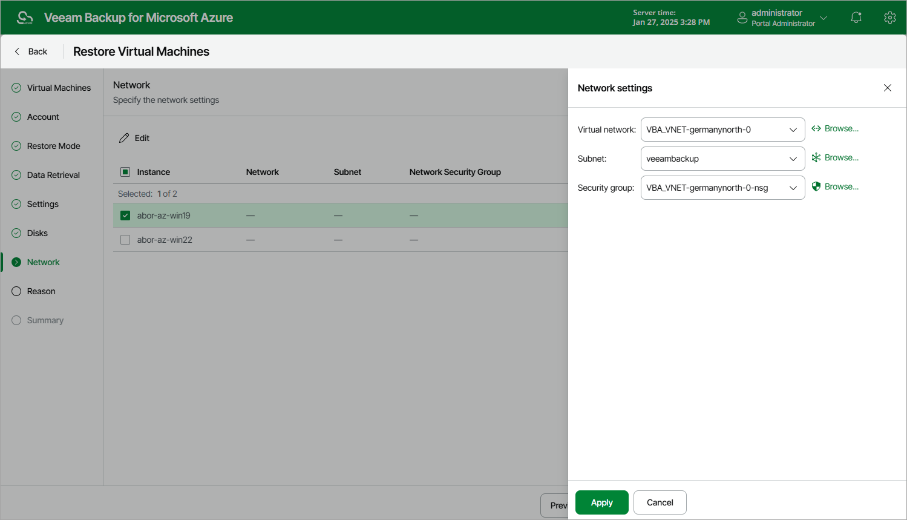

In this article

[This step applies only if you have selected the Restore to a new location, or different settings option at the Restore Mode step of the wizard]

At the Network step of the wizard, do the following:

1. Select the Azure VM.
2. Click Edit.
3. In the Network settings window, select a virtual network and a subnet to which you want to connect the restored Azure VM. For a virtual network to be displayed in the Virtual network list, it must be created in the Microsoft Azure portal as described in [Microsoft Docs](https://docs.microsoft.com/en-us/azure/virtual-network/manage-virtual-network). For a subnet to be displayed in the Subnet list, it must be created within the selected virtual network as described in [Microsoft Docs](https://docs.microsoft.com/en-us/azure/virtual-network/virtual-network-manage-subnet).

You can also specify a security group (virtual firewall) that will be associated with the restored VM. Security groups are used to filter network inbound traffic to and outbound traffic from Azure resources. Each security group contains a set of rules that control the traffic. For a network security group to be displayed in the Security group list, it must be created in the Microsoft Azure portal as described in [Microsoft Docs](https://docs.microsoft.com/en-us/azure/virtual-network/tutorial-filter-network-traffic#create-a-network-security-group).

Page updated 2/2/2024

Page content applies to build 8.0.1.202
