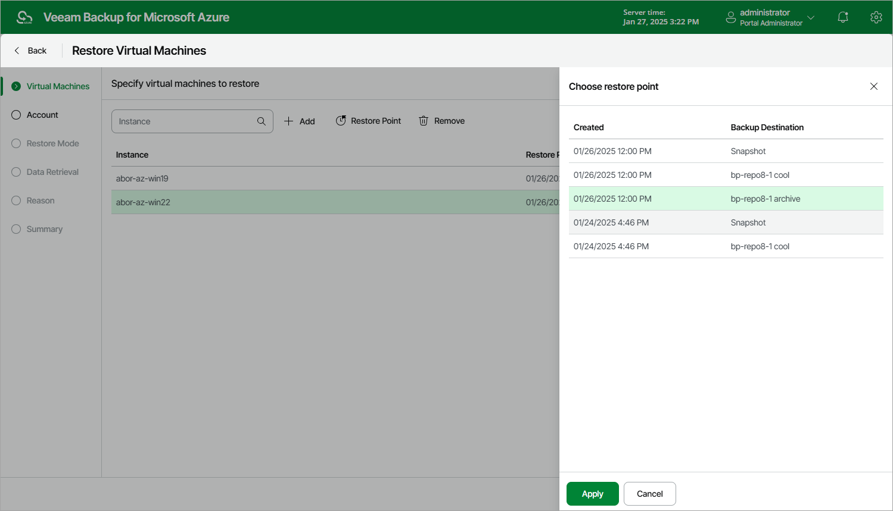

# Step 2. Select Restore Point

At the Virtual Machines step of the wizard, select a restore point that will be used to restore the selected Azure VM. By default, Veeam Backup for Microsoft Azure uses the most recent valid restore point. However, you can restore the Azure VM data to an earlier state.

|  |
| --- |
| Important |
| If you select a restore point stored in an archive repository and the same restore point is also available in a regular repository, Veeam Backup for Microsoft Azure will display the confirmation window where you must choose whether you want to use the archived or regular restore point to perform the restore operation. |

To select a restore point, do the following:

1. Select the Azure VM and click Restore Point.
2. In the Specify restore point window, select the necessary restore point and click Apply.

To help you choose a restore point, Veeam Backup for Microsoft Azure provides the following information on each available restore point:

* Created — the date when the restore point was created.
* Backup Destination — the type of the restore point:

* <Repository Name> — an image-level backup created by a backup policy.
* Snapshot — a cloud-native snapshot created by a backup policy.
* Manual Snapshot — a cloud-native snapshot created manually.

