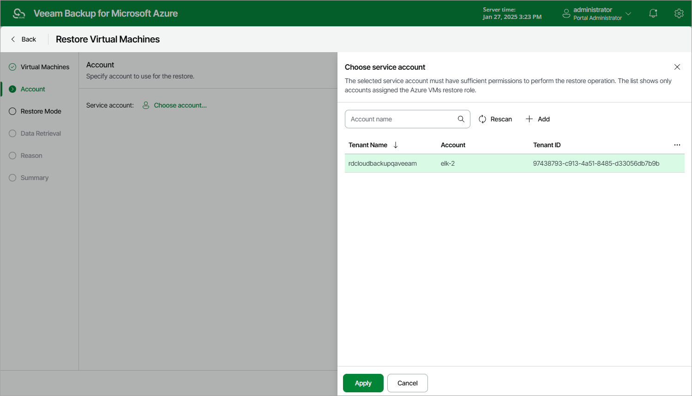

# Step 3. Select Service Account

At the Account step of the wizard, select a service account whose permissions Veeam Backup for Microsoft Azure will use to perform the restore operation.

1. Click Choose account.
2. In the Choose service account window, select the necessary account and click Apply. The specified service account must be assigned permissions listed in section [Azure VM Permissions](vm_permissions.md#restore).

For a service account to be displayed in the list of available accounts, it must be added to Veeam Backup for Microsoft Azure and assigned the Azure VMs Restore operational role as described in section [Adding Service Accounts](service_account_add.md). If you have not added the necessary service account to Veeam Backup for Microsoft Azure beforehand, you can do it without closing the Restore Virtual Machines wizard. To do that, click Add and complete the Add Account wizard.

