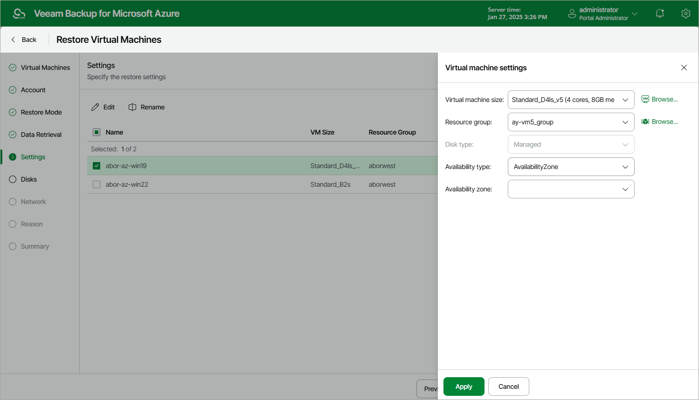

# Step 6. Specify Instance Settings

[This step applies only if you have selected the Restore to a new location, or different settings option at the Restore Mode step of the wizard]

At the Settings step of the wizard, do the following:

1. Select an Azure VM.
2. If you want to specify a name for the restored Azure VM, click Rename.

In the Virtual machine name window, specify a new name and click Apply.

1. If you want to change the Azure VM settings, click Edit.

In the Virtual machine settings window, do the following:

1. From the Virtual machine size drop-down list, select a VM size for the restored Azure VM. For more information on VM sizes, see [Microsoft Docs](https://docs.microsoft.com/en-us/azure/virtual-machines/linux/sizes-general).

|  |
| --- |
| Important |
| If the VM size of the original Azure VM differs from the size of the restored VM, Microsoft Azure may apply additional charges for maintaining the restored VM. |

1. From the Resource group drop-down list, select a resource group to which the restored Azure VM will belong.

For a resource group to be displayed in the Resource group list, it must be created in the Microsoft Azure portal as described in [Microsoft Docs](https://docs.microsoft.com/en-us/azure/azure-resource-manager/management/manage-resource-groups-portal).

1. From the Disk type drop-down list, select a type of virtual disks that will be attached to the restored Azure VM. For more information on disk types, see [Microsoft Docs](https://docs.microsoft.com/en-us/azure/virtual-machines/windows/managed-disks-overview).

1. Use the Availability type drop-down list to choose whether you want to include the restored Azure VM in an availability set or to place the VM in an availability zone.

Availability sets allow you to distribute VMs across multiple physical hardware resources. Availability zones allow you to distribute VMs across multiple unique physical locations and to protect your data from datacenter failures. For more information on availability options for virtual machines in Azure, see [Microsoft Docs](https://docs.microsoft.com/en-us/azure/virtual-machines/linux/availability).

1. To save changes made to the Azure VM settings, click Apply.

|  |
| --- |
| Note |
| On March 31, 2026, unmanaged disks will be retired in Microsoft Azure. That is why it is recommended that you use managed disks when restoring Azure VMs. For more information, see [Microsoft Docs](https://learn.microsoft.com/el-gr/azure/virtual-machines/unmanaged-disks-deprecation). |

