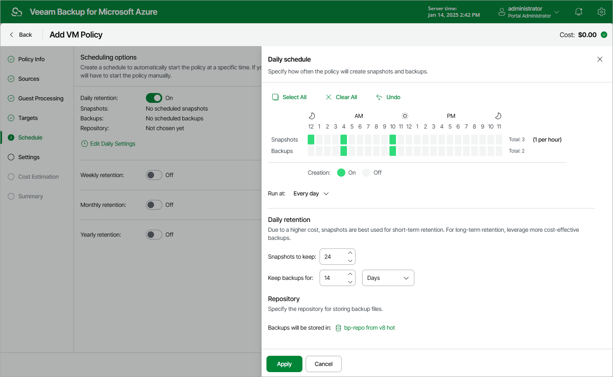

# Specifying Daily Schedule

To create a daily schedule for the backup policy, do the following at the Schedule step of the wizard:

1. Set the Daily retention toggle to On and click Edit Daily Settings.
2. In the Daily schedule window, select hours when the backup policy will create cloud-native snapshots and image-level backups. Use the Run at drop-down list to choose whether you want the backup policy to run every day, on weekdays (Monday through Friday) or on specific days.

If you want to protect Azure VM data more frequently, you can instruct the backup policy to create multiple cloud-native snapshots per hour. To do that, click the link to the right of the Snapshots hour selection area, and specify the number of cloud-native snapshots that the backup policy will create within an hour.

|  |
| --- |
| Note |
| Consider the following:   * Veeam Backup for Microsoft Azure does not create image-level backups independently from cloud-native snapshots. That is why when you select hours for image-level backups, the same hours are automatically selected for cloud-native snapshots. To learn how Veeam Backup for Microsoft Azure performs backup operations, see [Protecting Azure VMs](overview_vm.md). * Since Veeam Backup for Microsoft Azure runs retention sessions at 12:15 AM according to the time zone set on the backup appliance, it is not recommended that you schedule backup policies to execute at 12:15 AM. Otherwise, Veeam Backup for Microsoft Azure will not be able to run the retention sessions. |

1. In the Daily retention section, configure retention policy settings for the daily schedule:

* For cloud-native snapshots, specify the number of restore points that you want to keep in a snapshot chain.

If the restore point limit is exceeded, Veeam Backup for Microsoft Azure removes the earliest restore point from the chain. For more information, see [VM Snapshot Retention](vm_snapshot_retention.md).

* For image-level backups, specify the number of days (or months) for which you want to keep restore points in a backup chain.

If a restore point is older than the specified time limit, Veeam Backup for Microsoft Azure removes the restore point from the chain. For more information, see [VM Backup Retention](vm_backup_retention.md).

1. In the Repository section, select a repository where the created image-level backups will be stored.

For a repository to be displayed in the Repository list, it must be added to Veeam Backup for Microsoft Azure as described in section [Adding Backup Repositories](repository_add_ui.md) or [Adding Storage Vaults](repository_vdc_add_ui.md).

1. To save changes made to the backup policy settings, click Apply.

|  |
| --- |
| Tip |
| Veeam Backup for Microsoft Azure will start applying the configured retention settings as soon as the backup policy produces restore points. Even if you disable the daily schedule after the restore points are created, the retention policy will still be applied to these restore points. As a workaround, you can modify the configured retention settings. |

Considerations and Limitations

When you configure retention policy settings, consider the following:

* For Veeam Backup for Microsoft Azure to be able to use the [Changed Block Tracking](changed_block_tracking.md) (CBT) mechanism when processing Azure VM data, you must keep at least one cloud-native snapshot in the snapshot chain.
* Regardless of the number of restore points that you specify, Veeam Backup for Microsoft Azure permanently retains an additional cloud-native snapshot in the chain by design, which is required for proper CBT functioning.

To learn how the CBT mechanism works, see [Changed Block Tracking](changed_block_tracking.md).

* Veeam Backup for Microsoft Azure prioritizes [global retention settings](configuring_global_retention.md) over retention settings configured for backup policies. If snapshots produced by a backup policy are older than the global retention period, these snapshots will be removed anyway.

