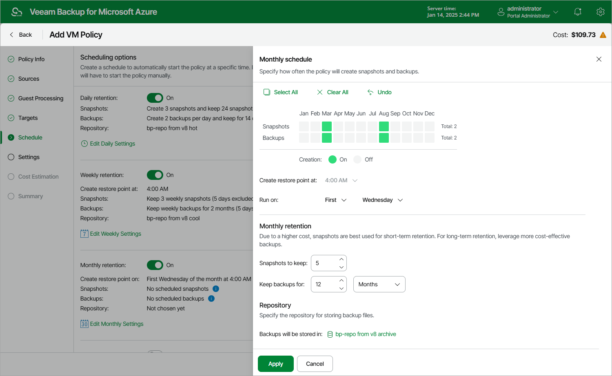

# Specifying Monthly Schedule

To create a monthly schedule for the backup policy, do the following at the Schedule step of the wizard:

1. Set the Monthly retention toggle to On and click Edit Monthly Settings.
2. In the Monthly schedule window, select months when the backup policy will create cloud-native snapshots and image-level backups.

|  |
| --- |
| Note |
| Veeam Backup for Microsoft Azure does not create image-level backups independently from cloud-native snapshots. That is why when you select months for image-level backups, the same months are automatically selected for cloud-native snapshots. To learn how Veeam Backup for Microsoft Azure performs backup operations, see [Protecting Azure VMs](overview_vm.md). |

1. Use the Create restore points at and Run at drop-down lists to schedule a specific time and day for the backup policy to run.

|  |
| --- |
| Notes |
| * If you have selected a specific time for the backup policy to run at the Weekly schedule section of the Schedule step of the wizard, you will not be able to change the time for the monthly schedule unless you select the On Day option. * If you select the On Day option, [harmonized scheduling](vm_harmonized_scheduling.md) cannot be guaranteed. Plus, to support the On Day option, Veeam Backup for Microsoft Azure will require to create an additional temporary restore point if there are no other schedules planned to run on that day. However, the temporary restore point will be removed from Microsoft Azure during the Backup Retention process in approximately 24 hours, to reduce unexpected infrastructure charges. |

1. In the Monthly retention section, configure retention policy settings for the monthly schedule:

* For cloud-native snapshots, specify the number of restore points that you want to keep in a snapshot chain.

If the restore point limit is exceeded, Veeam Backup for Microsoft Azure removes the earliest restore point from the chain. For more information, see [VM Snapshot Retention](vm_snapshot_retention.md).

* For image-level backups, specify the number of days (or months) for which you want to keep restore points in a backup chain.

If a restore point is older than the specified time limit, Veeam Backup for Microsoft Azure removes the restore point from the chain. For more information, see [VM Backup Retention](vm_backup_retention.md).

1. In the Repository section, select a repository where the created image-level backups will be stored.

For a repository to be displayed in the Repository list, it must be added to Veeam Backup for Microsoft Azure as described in section [Adding Backup Repositories](repository_add_ui.md) or [Adding Storage Vaults](repository_vdc_add_ui.md).

1. To save changes made to the backup policy settings, click Apply.

|  |
| --- |
| Tip |
| Veeam Backup for Microsoft Azure will start applying the configured retention settings as soon as the backup policy produces restore points. Even if you disable the daily schedule after the restore points are created, the retention policy will still be applied to these restore points. As a workaround, you can modify the configured retention settings. |

Considerations and Limitations

When you configure retention policy settings, consider the following:

* For Veeam Backup for Microsoft Azure to be able to use the [Changed Block Tracking](changed_block_tracking.md) (CBT) mechanism when processing Azure VM data, you must keep at least one cloud-native snapshot in the snapshot chain.

To learn how the CBT mechanism works, see [Changed Block Tracking](changed_block_tracking.md).

* It is recommended that you do not set the Snapshots to keep value to 0. Otherwise, Veeam Backup for Microsoft Azure will not be able to use the CBT mechanism, and the completion time of incremental backups may occur to grow significantly.

* Regardless of the number of restore points that you specify, Veeam Backup for Microsoft Azure permanently retains an additional cloud-native snapshot in the chain by design, which is required for proper CBT functioning.
* Veeam Backup for Microsoft Azure prioritizes [global retention settings](configuring_global_retention.md) over retention settings configured for backup policies. If snapshots produced by a backup policy are older than the global retention period, these snapshots will be removed anyway.

