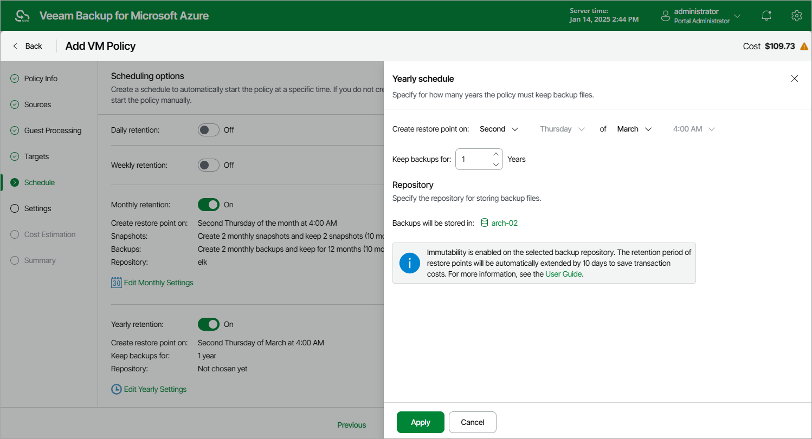

# Specifying Yearly Schedule

[This step applies only if you have instructed Veeam Backup for Microsoft Azure to create image-level backups at the Targets step of the wizard]

To create a yearly schedule for the backup policy, do the following at the Schedule step of the wizard:

1. Set the Yearly retention toggle to On and click Edit Yearly Settings.
2. In the Yearly schedule window, specify a day, month and time when the backup policy will create image-level backups.

For example, if you select First, Friday, January and 06:00 PM, the backup policy will run every first Friday of January at 06:00 PM.

|  |
| --- |
| Notes |
| * If you have selected a specific time for the backup policy to run at the Weekly schedule or Monthly schedule sections of the Schedule step of the wizard, you will not be able to change the time for the yearly schedule unless you select the On Day option from the Create restore point on drop-down list. * If you select the On Day option, [harmonized scheduling](vm_harmonized_scheduling.md) cannot be guaranteed. Plus, to support the On Day option, Veeam Backup for Microsoft Azure will require to create an additional temporary restore point if there are no other schedules planned to run on that day. However, the temporary restore point will be removed from Microsoft Azure during the Backup Retention process in approximately 24 hours, to reduce unexpected infrastructure charges. |

1. In the Keep backups for field, specify the number of years for which you want to keep restore points in a backup chain.

If a restore point is older than the specified time limit, Veeam Backup for Microsoft Azure removes the restore point from the chain. For more information, see [VM Backup Retention](vm_backup_retention.md).

Keep in mind that Veeam Backup for Microsoft Azure prioritizes global retention settings over retention settings configured for backup policies — if snapshots produced by a backup policy are older than the global retention period, these snapshots will be removed anyway. For more information, see [Configuring Global Retention Settings](configuring_global_retention.md).

1. In the Repository section, select a repository where the created image-level backups will be stored.

For a repository to be displayed in the Repository list, it must be added to Veeam Backup for Microsoft Azure as described in section [Adding Backup Repositories](repository_add_ui.md) or [Adding Storage Vaults](repository_vdc_add_ui.md).

1. To save changes made to the backup policy settings, click Apply.

|  |
| --- |
| Tip |
| Veeam Backup for Microsoft Azure will start applying the configured retention settings as soon as the backup policy produces restore points. Even if you disable the daily schedule after the restore points are created, the retention policy will still be applied to these restore points. As a workaround, you can modify the configured retention settings. |

