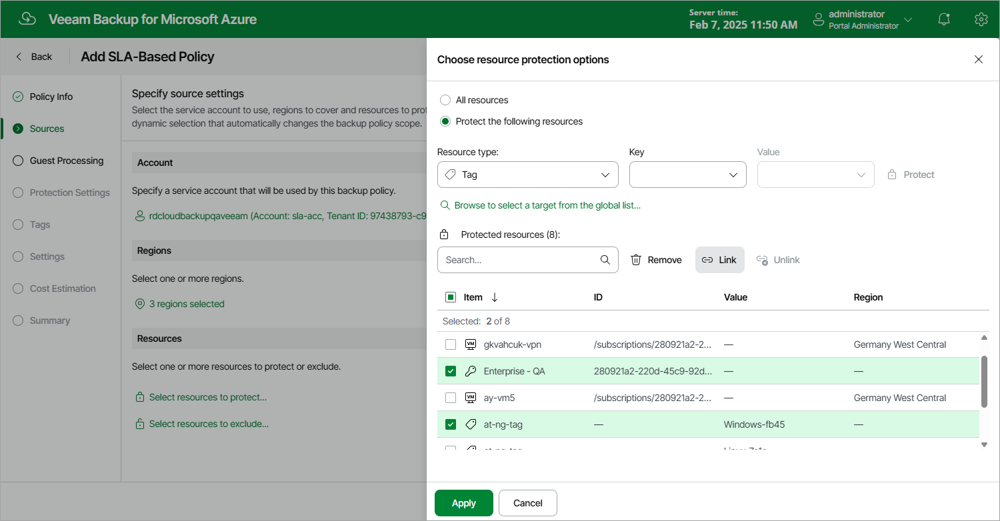

# Configuring Conditions

By default, Veeam Backup for Microsoft Azure uses the OR operator to link all the subscriptions, resource groups and tags that you include into the backup scope — meaning that all the related VMs will be protected by the policy. To narrow down the backup scope, you can configure conditions that will allow Veeam Backup for Microsoft Azure to link the selected resources using the AND operator.

When you configure a condition, Veeam Backup for Microsoft Azure composes a list of VMs to protect based on the resources that you add to this condition — meaning that an Azure VM will be protected by the policy only if this VM relates to all the linked resources. Keep in mind that one condition can link either multiple tags, a subscription with one or more tags, or a resource group with one or more tags.

To configure a condition, do the following in the Resources section of the Sources step of the wizard:

1. Click Select resources to protect.
2. In the Choose resource protection options window, select check boxes next to the items you want to include into the condition and click Link.
3. In the Create Condition window, provide a name for the condition and click Apply.

The maximum length of the name is 64 characters.

When configuring conditions, you can add the same resource to the list of protected resources multiple times. For example, if you want to protect VMs that are managed by the dept-01-sweden subscription and that have either the Veeam-01 tag or Veeam-02 tag assigned (but not both tags at the same time), you must add this subscription to the list of protected resources twice and then configure 2 separate conditions: one condition will link the subscription with the Veeam-01 tag, while another condition will link the subscription with the Veeam-02 tag.

|  |
| --- |
| Tip |
| After you configure a condition, you will be able to modify the list of resources included into this condition, unlink all the resources, and remove the condition if you no longer need it. When performing these actions, keep in mind that:   * If you exclude a resource from the condition, Veeam Backup for Microsoft Azure will re-add it to the list of protected resources as a single item. * If you unlink the condition, Veeam Backup for Microsoft Azure will re-add all resources that were included into this condition to the list of protected resources as single items, and will link these resources using the OR operator. * If you remove the condition, Veeam Backup for Microsoft Azure will remove all resources that were included into this condition from the backup scope. |

