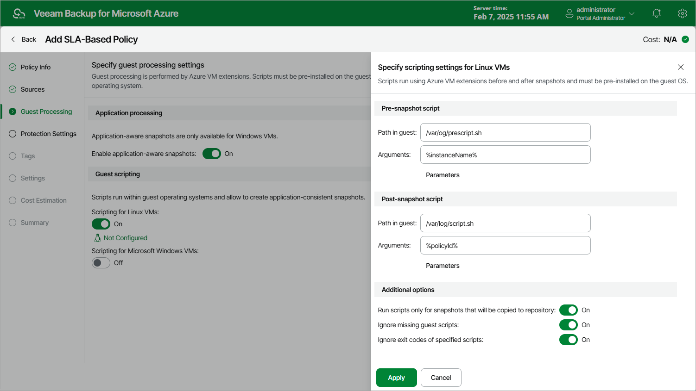

# Enabling Guest Scripting

[Applies for users that have the Portal Administrator role only]

To enable guest scripting, do the following at the Guest Processing step of the wizard:

* For Azure VMs running Linux OS, set the Scripting for Linux instances toggle to On.

The Specify scripting settings for Linux instances window will open.

* For Azure VMs running Microsoft Windows OS, set the Scripting for Microsoft Windows instances toggle to On.

The Specify scripting settings for Windows instances window will open.

|  |
| --- |
| Important |
| When enabling guest scripting, consider the following:   * Veeam Backup for Microsoft Azure supports the EXE, BAT, CMD, WSF, JS, VBS and PS1 file formats for Windows-based Azure VMs, and the SH file format for Linux-based Azure VMs. * To run custom scripts on Windows-based Azure VMs, Veeam Backup for Microsoft Azure uses the Run Command feature. For more information, see [Microsoft Docs](https://learn.microsoft.com/en-us/azure/virtual-machines/windows/run-command). |

In the opened window, specify pre-snapshot and post-snapshot scripts that will be executed before and after the backup operation:

1. In the Pre-snapshot script section, do the following:

1. In the Path in guest field, specify a path to the directory on an Azure VM where the pre-snapshot script file resides.
2. In the Arguments field, specify additional arguments that will be passed to the script when the script is executed.

You can use runtime variables as arguments for the script. To see the list of available variables, click Parameters.

|  |
| --- |
| Important |
| Veeam Backup for Microsoft Azure will try to run a script residing in the specified directory for all Azure VMs added to the SLA-based backup policy. If you want to execute different scripts for different Azure VMs, ensure that script files uploaded to these VMs have the same path and name. |

1. Repeat step 1 for the post-snapshot scripts in the Post-snapshot script section.

1. In the Additional Options section, choose whether you want to run scripts only while creating repository snapshots, to proceed with snapshot creation even though scripts are missing on some of the processed instances, and to ignore exit codes returned while executing the scripts.
2. Click Apply.

