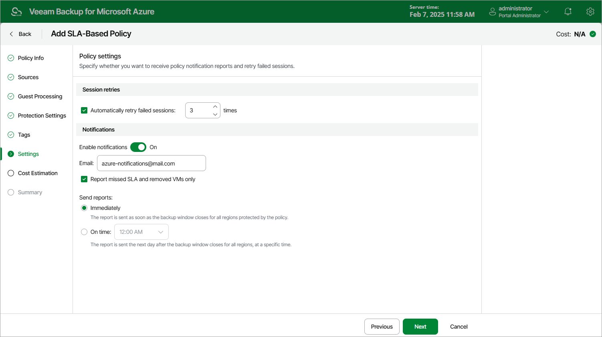

In this article

At the Settings step of the wizard, you can enable automatic retries and specify notification settings for the SLA-based backup policy policy.

Automatic Retry Settings

To instruct Veeam Backup for Microsoft Azure to run a policy session again if it fails on the first try, do the following:

1. In the Session retries section of the step, select the Automatic retry failed sessions check box.
2. In the field to the right of the check box, specify the maximum number of attempts to run the policy sessions. The time interval between retries is 600 seconds.

When retrying policy sessions, Veeam Backup for Microsoft Azure processes only those Azure VMs that failed to be backed up during the previous attempt.

Notification Settings

To instruct Veeam Backup for Microsoft Azure to send email notifications for the policy, do the following:

1. In the Notifications section of the step, set the Enable notifications toggle to On.

If you set the toggle to Off, Veeam Backup for Microsoft Azure will not send any notifications for this backup policy — regardless of the configured [global notification settings](configuring_notification_settings.md).

1. In the Email field, specify an email address of a recipient. Use a semicolon to separate multiple recipient addresses.
2. Select the Report missed SLA and removed VMs only check box if you want Veeam Backup for Microsoft Azure to send email notifications only in case the backup policy fails to meet SLA target value, or if any Azure VMs added to the policy are [considered removed](sla_calculation.md#removed_vms) from Microsoft Azure.
3. Use the Send reports setting to define whether you want Veeam Backup for Microsoft Azure to send email notifications immediately after it finalizes the backup window specified for the policy in all regions added to the policy and completes calculating SLA compliance ratio, or at a specific time after Veeam Backup for Microsoft Azure finalizes the backup window specified for the policy in all regions added to the policy and completes calculating SLA compliance ratio.

|  |
| --- |
| Note |
| If you specify the same email recipient in both backup policy notification and [global notification settings](configuring_notification_settings.md), Veeam Backup for Microsoft Azure will override the configured global notification settings and will send each notification to this recipient only once to avoid notification duplicates. |

Page updated 3/25/2025

Page content applies to build 8.0.1.202
