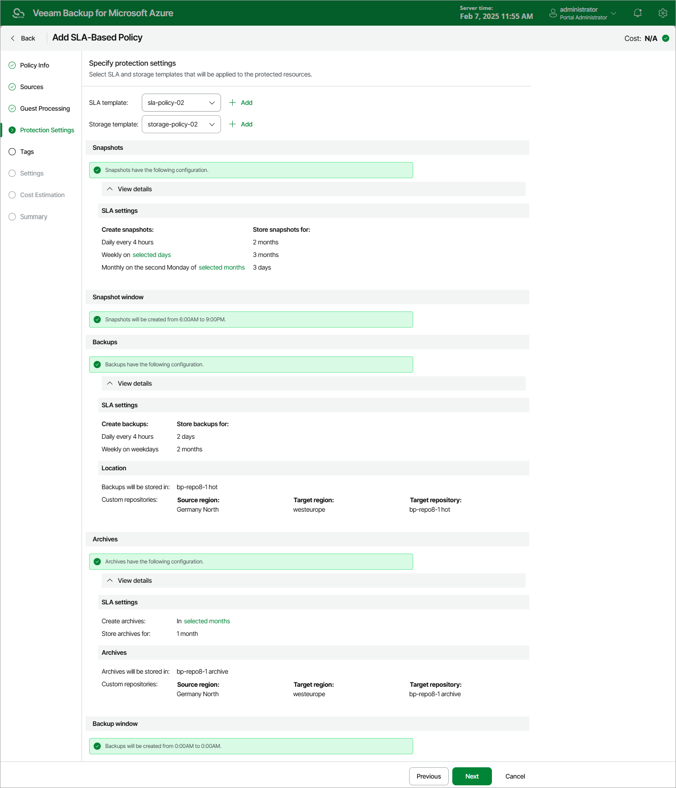

In this article

At the Protection Settings step of the wizard, select an SLA and a storage template that will be assigned to the policy:

1. From the SLA template list, select an SLA template whose snapshot, backup and archived backup settings the policy will use to protect workloads specified at [step 3c](vm_sla_source_settings.md#resources).

For an SLA template to be displayed in the list, it must be added to Veeam Backup for Microsoft Azure as described in section [Adding SLA Templates](sla_add.md). If you have not added the necessary SLA template to Veeam Backup for Microsoft Azure beforehand, you can do it without closing the SLA-Based Policy wizard. To do that, click Add and complete the Add SLA Template wizard.

1. From the Storage template list, select a storage template whose target location settings the policy will use to store backed-up data.

For a storage template to be displayed in the list, it must be added to Veeam Backup for Microsoft Azure as described in section [Adding Storage Templates](storage_add.md). If you have not added the necessary storage template to Veeam Backup for Microsoft Azure beforehand, you can do it without closing the SLA-Based Policy wizard. To do that, click Add and complete the Add Storage Template wizard.

|  |
| --- |
| Important |
| * The snapshot, backup and archived backup settings configured for the selected SLA template must match the target location settings configured for the selected storage template. That is, if backups are configured for the selected SLA template, make sure you configured backup location settings for the storage template, and if archive backups are configured for the selected SLA template, make sure you configured archived backup location settings for the storage template. * It is recommended that you create the SLA-based backup policy at any time outside the data protection windows configured for the selected SLA template — otherwise, Veeam Backup for Microsoft Azure may show an incorrect SLA compliance ratio for the day when the policy was created. |

Page updated 10/20/2025

Page content applies to build 8.0.1.202
